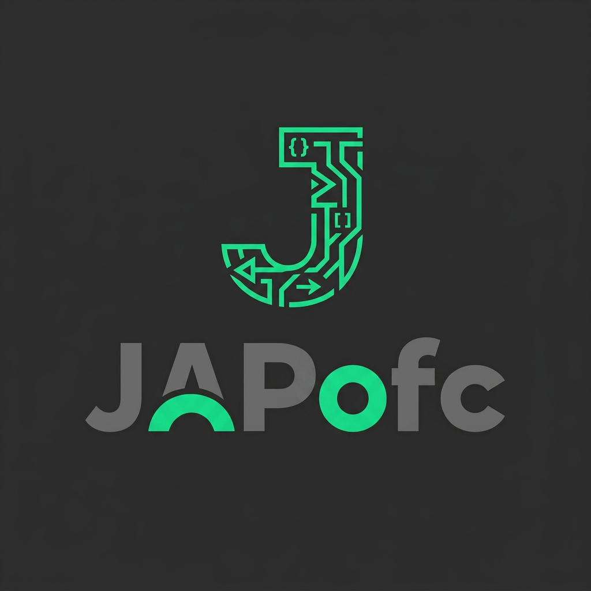

<div align="center" id="top">



# @japofc/baileys

### ⚡ WhatsApp Web API yang dirawat serius untuk Node.js

<em>ESM typed&nbsp;·&nbsp;versi WA&nbsp;Web selalu terkini&nbsp;·&nbsp;tooling protokol aman&nbsp;·&nbsp;140+ utilitas bot siap produksi</em>

<br/>

<!-- identitas -->
<p>
<a href="https://www.npmjs.com/package/@japofc/baileys"></a>
<a href="https://www.npmjs.com/package/@japofc/baileys"></a>
<a href="./NOTICE.md"></a>
</p>

<!-- kualitas -->
<p>
=20" />


</p>

<p>
<a href="https://whatsapp.com/channel/0029VbEVFrILtOjAOu4FXa3r"></a>
</p>

<h4>

[📦 Instalasi](#instalasi)&nbsp;·&nbsp;[🚀 Mulai cepat](#mulai-cepat)&nbsp;·&nbsp;[🔥 Fitur](#-fitur)&nbsp;·&nbsp;[💡 Contoh](#-contoh-pemakaian)&nbsp;·&nbsp;[📘 TypeScript](#-dukungan-typescript)&nbsp;·&nbsp;[❓ FAQ](#-faq--troubleshooting)&nbsp;·&nbsp;[🇬🇧 English](./README.md)

</h4>

</div>

---

<table>
<tr>
<td width="33%" valign="top" align="center">

### 🔌 Inti yang andal

Socket stabil, resolusi versi WA-Web otomatis, toolkit reconnect + anti-ban — **tanpa efek samping tersembunyi**.

</td>
<td width="33%" valign="top" align="center">

### 🧩 Lengkap sejak awal

Tombol, native flow, carousel, kartu AIRich, poll, channel, VoIP, dan **140+ utilitas bot**.

</td>
<td width="33%" valign="top" align="center">

### 🛡️ Siap produksi

`.d.ts` bawaan, auth multi-backend, redaksi kredensial, session tools — **1237 tes, 0 kerentanan**.

</td>
</tr>
</table>

<details>
<summary><b>📑 Daftar isi</b> — klik untuk buka</summary>

<br/>

> **Mulai** &nbsp;›&nbsp; [Instalasi](#instalasi) · [Mulai cepat](#mulai-cepat) · [Ringkasan](#ringkasan) · [Instalasi lengkap](#-instalasi) · [Autentikasi](#-autentikasi) · [Backend store](#-backend-store)
>
> **Isi paket** &nbsp;›&nbsp; [Perbandingan](#-perbandingan) · [Fitur](#-fitur) · [Peningkatan eksklusif J.AP](#-peningkatan-eksklusif-jap) · [Baru di v2.4.5](#-baru-di-v245)
>
> **Pesan** &nbsp;›&nbsp; [Contoh pemakaian](#-contoh-pemakaian) · [Helper pesan](#-helper-pesan) · [Channel, riwayat & transkrip](#-channel-riwayat--transkrip) · [Kejar-tayang WA 2026](#-kejar-tayang-wa-2026)
>
> **Panggilan & sync** &nbsp;›&nbsp; [Panggilan suara & video](#-panggilan-suara--video) · [Query sinkronisasi user](#-query-sinkronisasi-user) · [Manajemen username](#-manajemen-username)
>
> **Toolkit** &nbsp;›&nbsp; [Utilitas sehari-hari](#-utilitas-sehari-hari) · [Paket keamanan](#-paket-keamanan) · [Bot framework](#-bot-framework) · [Modul utilitas](#-modul-utilitas)
>
> **Referensi** &nbsp;›&nbsp; [Lingkungan yang direkomendasikan](#-lingkungan-yang-direkomendasikan) · [Dukungan TypeScript](#-dukungan-typescript) · [FAQ & troubleshooting](#-faq--troubleshooting) · [Kontribusi](#-kontribusi) · [Kredit](#-kredit) · [Maintainer](#-maintainer)

</details>

---

## Instalasi

```bash
npm i @japofc/baileys
```

Butuh Node.js 20+. Package ini ESM-only dan tidak memakai install/postinstall script.

## Mulai cepat

```js
import makeWASocket, { useMultiFileAuthState } from '@japofc/baileys'

const { state, saveCreds } = await useMultiFileAuthState('auth_info')
const sock = makeWASocket({ auth: state, printQRInTerminal: true })

sock.ev.on('creds.update', saveCreds)
sock.ev.on('messages.upsert', async ({ messages }) => {
  const msg = messages[0]
  if (!msg?.message || msg.key.fromMe) return
  await sock.sendMessage(msg.key.remoteJid, { text: 'pong' }, { quoted: msg })
})
```

## Ringkasan

`@japofc/baileys` adalah library WhatsApp Web untuk builder bot yang butuh socket stabil, deklarasi TypeScript lengkap, dan utilitas yang dirawat tanpa efek samping tersembunyi.

- Fallback versi WA Web terbaru plus `makeWASocketAuto()` untuk resolusi versi live.
- Deklarasi WAProto lengkap dan deep export untuk pemakaian dari package ter-install.
- Backend auth file, SQLite, Redis, MongoDB, MySQL, dan PostgreSQL.
- Interactive messages, native flow, carousel, AIRich, channel/newsletter, status helper, dan modul bot.
- Fetch media/link lebih aman, redaksi kredensial, tool sesi, helper reconnect, dan protocol-capture.
- **Tidak ada auto join/follow grup atau saluran.** Helper join/follow tetap tersedia, tapi hanya jalan kalau dipanggil eksplisit oleh kode kamu.

---

## 🆚 Perbandingan

Posisi `@japofc/baileys` dibanding library Baileys lain:

| Kemampuan | `@japofc/baileys` | Fork lain (umumnya) |
|---|:---:|:---:|
| Tombol Native Flow (V1/V2/V3) | ✅ | ⚠️ sebagian |
| Pesan carousel | ✅ | ❌ |
| Kartu respons kaya (AIRich) | ✅ | ❌ |
| Alur commerce (katalog/order/pembayaran) | ✅ | ⚠️ sebagian |
| Panggilan suara (VoIP) | ✅ eksperimental | ❌ |
| Store multi-backend (SQL/Mongo/Redis) | ✅ | ⚠️ sebagian |
| Definisi TypeScript `.d.ts` lengkap | ✅ | ⚠️ sebagian |
| Query sinkronisasi user (WAUSync) | ✅ | ✅ |
| Manajemen username (cek/set/pin/rekomendasi) | ✅ | ❌ |
| Framework bot (middleware, sesi, statistik) | ✅ | ❌ |
| Render QR bawaan (terminal/SVG/PNG, nol deps) | ✅ | ❌ butuh `qrcode-terminal` |
| Resolusi versi WA Web otomatis | ✅ | ❌ hardcoded |
| Mention di status (notifikasi user/grup) | ✅ | ❌ |
| Toolkit anti-ban (ramp pemanasan, batas aksi grup, klasifikasi disconnect, jitter Gaussian) | ✅ | ❌ |
| Perisai pesan crash (bom mention, zalgo, spoof RTLO) | ✅ | ❌ |
| Dokter sesi + string sesi portabel/terenkripsi | ✅ | ❌ |
| Modul komunitas/bot (economy, game, sewa, moderasi — 140+ utils) | ✅ | ❌ |
| Branding EXIF stiker | ✅ murni JS | ⚠️ butuh `node-webpmux` |
| CLI (`doctor` / `session` / `sticker` / `export` / `wa`) | ✅ | ❌ |
| Logger dengan redaksi kredensial | ✅ | ❌ |

> Tabel ini menggambarkan fitur di level package, bukan benchmark performa. PR untuk memperbarui/mengoreksi tabel ini dipersilakan lewat [Kontribusi](#-kontribusi).

---

## 🔥 Fitur

<table>
<tr>
<th align="center">💬 Pesan Interaktif</th>
<th align="center">🛒 Commerce & Bisnis</th>
<th align="center">🧩 Fitur Utilitas</th>
</tr>
<tr>
<td valign="top">

- Native Flow
- Tombol (V1 / V2 / V3)
- List
- Pesan Carousel
- Pesan Poll & Kuis
- Pesan Respons Kaya (AIRich)
- Tombol CTA / Reply / URL
- Tombol Panggilan
- Tombol OTP
- Tombol Autentikasi

</td>
<td valign="top">

- Pesan Katalog
- Detail Order
- Status Order
- Review & Bayar
- Status Pembayaran
- Metode Pembayaran
- Lacak Order
- Pesan Ulang
- Batalkan Order

</td>
<td valign="top">

- Dukungan Status Grup
- Mention Semua
- Dukungan Stiker Lottie
- Dukungan Newsletter
- Helper ExternalAdReply
- Dukungan View Once
- Format Teks Kaya
- Highlight Kode

</td>
</tr>
</table>

<table>
<tr>
<th align="center">🔐 Auth & Penyimpanan</th>
<th align="center">📞 Realtime</th>
<th align="center">🛠 Tooling Developer</th>
</tr>
<tr>
<td valign="top">

- Auth state multi-file
- Auth state satu file
- Auth state SQLite
- Auth state cache-manager
- Store in-memory
- Adapter store SQLite / MongoDB /
  MySQL / PostgreSQL / Redis

</td>
<td valign="top">

- Panggilan suara (VoIP, engine WASM)
- Query sinkronisasi user (WAUSync)
- Cek presence / status / perangkat
- Event buffer untuk bot trafik tinggi

</td>
<td valign="top">

- Definisi TypeScript lengkap (`.d.ts`)
- Deteksi anti-delete & anti-edit (pulihkan pesan terhapus, tangkap isi sebelum edit)
- Helper pencarian pesan
- Engine auto-reply
- Helper penjadwalan
- Manajer retry pesan

</td>
</tr>
</table>

---

## ✨ Peningkatan Eksklusif J.AP

### Perbaikan Status Grup Audio
Status audio memakai implementasi yang lebih kompatibel untuk menghindari error unsupported-version di klien WhatsApp lama.

### AIRich — builder pesan respons kaya
Builder chainable (`AIRich`, juga diekspor sebagai `AIJap` / `LeafRich` / `JapAI` / `JapRich`) dengan 40+ method `add*()`/`set*()` yang mencakup heading, teks berformat (hyperlink/sitasi/LaTeX), blok kode, tabel, kartu gambar/video/produk/post, kartu tugas & progres, banner tips, dan saran quick-reply — tampilan kartu kaya yang biasanya cuma kamu lihat dari bot AI/asisten resmi. Lihat [Contoh Pemakaian](#airich--kartu-respons-kaya) di bawah.

### Ekspansi Native Flow

<table>
<tr>
<td valign="top" width="33%">

**Tombol & Aksi**
- cta_reminder
- cta_cancel_reminder
- otp_button
- authentication_button
- call_button
- url_button
- reply_button
- voice_call
- video_call_button

</td>
<td valign="top" width="33%">

**Alur Commerce**
- catalog_message
- mpm
- card_message
- order_details
- order_status
- review_and_pay
- payment_status
- payment_method

</td>
<td valign="top" width="33%">

**Navigasi & Lainnya**
- address_message
- send_location
- track_order
- reorder
- cancel_order
- clear_chat
- navigateToScreen
- flow_action

</td>
</tr>
</table>

### Filter Notifikasi Sistem

Setiap pesan menyertakan:

```js
message.isSystemNotification
```

Berguna untuk memfilter:

- Pemberitahuan E2E
- Pemberitahuan layanan Meta
- Pesan lain yang dihasilkan sistem

---

## 📦 Instalasi

```bash
npm install @japofc/baileys
```

Langsung dari GitHub:

```bash
npm install github:JAPofc/baileys
```

> Butuh **Node.js 20+** — dicek saat import dengan pesan error yang jelas (tanpa install script: paket ini sengaja **nol** hook `preinstall`/`postinstall`, jadi `npm ci --ignore-scripts` dan kebijakan supply-chain ketat langsung jalan).

> **Pindahan dari `@whiskeysockets/baileys`?** Migrasi biasanya cuma ganti satu baris import — lihat [MIGRATION.md](./MIGRATION.md).

### Peer dependency opsional

Semua di bawah ini **opsional** — socket tetap jalan tanpa satu pun. Install hanya yang dibutuhkan fitur yang kamu pakai; yang belum terinstall akan gagal dengan petunjuk install yang jelas, bukan crash diam-diam.

| Paket | Membuka fitur |
|---|---|
| `sharp` | Resize/proses gambar cepat (dipakai `Toolkit.resize` milik builder pesan) |
| `@napi-rs/image` | Alternatif native yang lebih ringan dari `sharp` |
| `jimp` | Fallback gambar pure-JS kalau dua di atas tidak terinstall |
| `fluent-ffmpeg` | Konversi audio/video untuk pesan media |
| `ffmpeg-static` | **Binary** ffmpeg terbundel — auto-terdeteksi, nol konfigurasi (~80MB; tidak tersedia untuk Termux/Android, pakai `pkg install ffmpeg` di sana) |
| `@ffmpeg-installer/ffmpeg` | Binary ffmpeg terbundel alternatif — juga auto-terdeteksi |
| `audio-decode` | Ekstraksi waveform/durasi audio (voice note, capture VoIP) |
| `link-preview-js` | Preview link kaya untuk URL di pesan teks keluar |
| `better-sqlite3` | Auth state SQLite, adapter store SQLite, **dan** `SQLiteStore`/`StatsManager` milik [Bot Framework](#-bot-framework) |
| `mongodb` | Adapter store MongoDB |
| `mysql2` | Adapter store MySQL |
| `pg` | Adapter store PostgreSQL |
| `ioredis` | Adapter store Redis |
| `@roamhq/wrtc` | Binding WebRTC native untuk [panggilan suara](#-panggilan-suara--video) |

#### ffmpeg: cara dia ditemukan

Semua fitur yang memanggil ffmpeg (thumbnail video, konversi stiker, konversi voice note, feeding audio VoIP) mencari binary lewat satu resolver terpusat, dengan urutan:

1. **Override kamu** — `setFfmpegPath('/path/ke/ffmpeg')` (diekspor dari paket) atau env var `FFMPEG_PATH`
2. **`ffmpeg-static`** — kalau terinstall, binary bundelannya dipakai otomatis
3. **`@ffmpeg-installer/ffmpeg`** — sama, sebagai alternatif
4. **`ffmpeg` sistem** di `PATH` kamu

Jadi di server biasa cukup `npm i ffmpeg-static` dan tidak perlu mikir lagi. Di **Termux/Android** (di mana kedua paket npm itu tidak punya binary) install versi sistem — otomatis kepakai:

```sh
pkg install ffmpeg
```

Kalau tidak ketemu sama sekali, fiturnya gagal dengan petunjuk install per-platform, bukan error misterius `spawn ffmpeg ENOENT`.

#### Cek lingkunganmu (doctor)

Bingung kenapa suatu fitur tidak jalan? Satu panggilan ini mendiagnosa semuanya — versi Node, dependency opsional mana yang terinstall, ffmpeg ketemu di mana, backend gambar yang aktif:

```js
import { printEnvironmentReport } from '@japofc/baileys'
await printEnvironmentReport() // cetak laporan lengkap + return snapshot-nya
// atau versi data mentah tanpa cetak:
import { checkEnvironment } from '@japofc/baileys'
const env = await checkEnvironment() // { ok, platform, node, ffmpeg, imageBackend, optionalDeps, warnings }
```

Atau langsung dari terminal, tanpa nulis kode:

```sh
npx @japofc/baileys doctor    # exit code 0 = semua beres, 1 = ada warning
npx @japofc/baileys version
```

---

## 🚀 Mulai Cepat

```js
import { makeWASocketAuto, useMultiFileAuthState } from '@japofc/baileys'

const { state, saveCreds } = await useMultiFileAuthState('auth_info')

// makeWASocketAuto mengambil versi WA Web terbaru sebelum konek
// (sw.js WA -> fork -> fallback), mencegah error 405 pairing karena versi basi.
// Lebih suka sync? `makeWASocket({ auth: state })` tetap jalan seperti biasa.
const sock = await makeWASocketAuto({
    auth: state
})

// simpan kredensial setiap kali Baileys memperbaruinya
sock.ev.on('creds.update', saveCreds)

sock.ev.on('connection.update', (update) => {
    const { connection, qr } = update

    // Paling gampang: kasih `printQRInTerminal: true` ke makeWASocket dan QR
    // digambar otomatis oleh renderer bawaan (nol dependency).
    // Render manual/custom dari event juga bisa:
    //   import { renderQRToTerminal, qrToSVG, qrToPNG } from '@japofc/baileys'
    //   if (qr) console.log(renderQRToTerminal(qr))          // terminal (▀▄█)
    //   if (qr) fs.writeFileSync('qr.svg', qrToSVG(qr))      // untuk web UI
    //   if (qr) fs.writeFileSync('qr.png', qrToPNG(qr))      // raster (kirim ke mana saja)
    if (qr) console.log('Dapat QR pairing')

    if (connection === 'open') console.log('🍃 Terhubung!')
})

sock.ev.on('messages.upsert', ({ messages }) => {
    const msg = messages[0]
    if (!msg.message || msg.key.fromMe) return
    console.log('Pesan baru dari', msg.key.remoteJid)
})
```

**Tips produksi** — bungkus socket dengan `autoReconnect()` dan urusan disconnect selesai otomatis (exponential backoff, tidak pernah reconnect saat `loggedOut`, reconnect langsung setelah pairing):

```js
import { makeWASocketAuto, autoReconnect, useMultiFileAuthState } from '@japofc/baileys'

const { state, saveCreds } = await useMultiFileAuthState('auth_info')
const manager = autoReconnect(() => makeWASocketAuto({ auth: state, printQRInTerminal: true }), {
    onSocket: sock => {
        sock.ev.on('creds.update', saveCreds)
        sock.ev.on('messages.upsert', handler) // dipasang ulang di setiap reconnect
    },
    onLoggedOut: () => console.log('hapus auth_info/ lalu pairing ulang'),
})
await manager.start()
```

Versi lengkap yang bisa langsung dijalankan: [`examples/auto-reconnect-bot.js`](./examples/auto-reconnect-bot.js).

### Login pakai pairing code (tanpa QR)

```js
import { makeWASocket, useMultiFileAuthState, formatPairingCode } from '@japofc/baileys'

const { state, saveCreds } = await useMultiFileAuthState('auth_info')
const sock = makeWASocket({ auth: state, printQRInTerminal: false })
sock.ev.on('creds.update', saveCreds)

if (!state.creds.registered) {
    const code = await sock.requestPairingCode('628123456789') // nomor internasional lengkap
    console.log('Pairing code:', formatPairingCode(code))      // "ABCD-EFGH"
}

// kode custom 8 karakter (Crockford base32: 1-9, A-Z tanpa I/O/U)
await sock.requestPairingCode('628123456789', 'JAPJAP12')
```

Input divalidasi di awal dengan error yang jelas, bukan gagal diam-diam di sisi server: karakter format (`+`, spasi, strip) dibersihkan, prefix telepon internasional `00` di depan dihapus otomatis, dan dua penyebab klasik langsung dilempar error — **nomor format lokal** (`08123...` padahal harusnya `628123...`, penyebab #1 "pairing code gak pernah dateng") dan nomor lebih dari 15 digit (batas maksimum E.164). Pengecekan yang sama tersedia mandiri sebagai `normalizePairingPhone(nomor)`. Untuk bot publik, batasi percobaan pairing dengan `withPairingGuard`.

**Observability** — pasang `createDebugMonitor()` untuk snapshot terstruktur yang aman
(status koneksi, alasan disconnect, uptime, persentil latensi pesan, hitungan retry kirim,
hitungan error Signal, status VoIP/WASM, memori). Snapshot ini **tidak pernah** berisi
payload QR, kode pairing, kunci auth, token, atau private key — seluruh snapshot melewati
`redactSecrets()` sebelum dikembalikan, jadi aman untuk di-log atau dilampirkan ke laporan
bug apa adanya:

```js
import { createDebugMonitor } from '@japofc/baileys'

const monitor = createDebugMonitor(sock)
// nanti — di health endpoint, log cron, atau crash handler:
console.log(JSON.stringify(monitor.getDebugInfo(), null, 2))
// { connection: { state, uptimeMs, lastDisconnect: { code, reason } },
//   messages: { received, decryptFailed, latencyMs: { p50, p90, p99 } },
//   sendRetries, signalErrors: { noSession, badMac, ... }, voip, memory }
```

**Protocol capture eksperimental** — fitur WhatsApp baru jangan ditebak dari asumsi;
pertama capture bentuk BinaryNode dari akun test yang memang kamu izinkan, rahasia
akan diredaksi, lalu baru buat wrapper high-level setelah kontrak wire-nya jelas:

```js
import { bindProtocolCapture } from '@japofc/baileys'

const capture = bindProtocolCapture(sock, { file: './wa-protocol.ndjson' })
// trigger fitur di official client / akun test yang paired
// tiap baris adalah JSON redacted: { direction, summary, node }
await capture.close()
```

---

## 🔐 Autentikasi

Empat backend auth-state tersedia langsung. Semuanya mengembalikan bentuk `{ state, saveCreds }` yang sama seperti yang diharapkan `makeWASocket({ auth })`, jadi bisa saling tukar tanpa ubah kode.

| Fungsi | Penyimpanan | Cocok untuk |
|---|---|---|
| `useMultiFileAuthState(folder)` | Satu file JSON per kunci, di disk | Pilihan default — sederhana, mudah di-debug, jalan di mana saja |
| `useSingleFileAuthState(namaFile)` | Satu file JSON, di disk | Bot kecil yang lebih mudah kelola/backup satu file |
| `useSqliteAuthState(opsi)` | SQLite (`better-sqlite3`) | Bot yang sudah pakai SQLite, atau mau auth di satu file DB embedded |
| `useCacheManagerAuthState(store, kunciSesi)` | Store apa pun yang kompatibel [`cacheable`](https://www.npmjs.com/package/@cacheable/node-cache) | Panel hosting multi-sesi, setup berbasis Redis |
| `useRedisAuthState(opsi)` | Redis (client `ioredis` **atau** node-redis) | Bot multi-instance, penyimpanan sesi bersama yang cepat |
| `useMongoAuthState(opsi)` | MongoDB (collection `mongodb`) | Bot yang sudah pakai Mongo; satu dokumen per key |
| `usePostgresAuthState(opsi)` | Postgres (`pg` Pool/Client) | Deployment produksi di Postgres; tabel dibuat otomatis |
| `useMySQLAuthState(opsi)` | MySQL/MariaDB (`mysql2/promise`) | Setup shared-hosting; tabel dibuat otomatis |
| `makeAuthStateFromStore(store)` | Backend key-value **apa pun** buatanmu | Database kustom — cukup implementasikan 5 method kecil |

```js
import { makeWASocket, useMultiFileAuthState } from '@japofc/baileys'

const { state, saveCreds } = await useMultiFileAuthState('auth_info')
const sock = makeWASocket({ auth: state })
sock.ev.on('creds.update', saveCreds)
```

```js
// Varian SQLite
import { makeWASocket, useSqliteAuthState } from '@japofc/baileys'

const { state, saveCreds } = await useSqliteAuthState({ database: './auth.db' })
const sock = makeWASocket({ auth: state })
sock.ev.on('creds.update', saveCreds)
```


Keempat adapter database menerima **client/collection yang sudah ada** (disarankan — kamu pegang kendali pooling & lifecycle) atau `uri` (driver di-import lazy hanya saat itu; tak ada yang jadi dependency wajib):

```js
// Varian Redis — jalan dengan ioredis DAN node-redis
import { makeWASocket, useRedisAuthState } from '@japofc/baileys'

const { state, saveCreds } = await useRedisAuthState({ client: myRedis, session: 'bot-1' })
const sock = makeWASocket({ auth: state })
sock.ev.on('creds.update', saveCreds)
```
`useMultiFileAuthState` juga mengekspor `pruneStaleAuthFiles(folder, opsi)` untuk membersihkan file sender-key lama secara terjadwal — berguna untuk bot yang jalan lama dan menumpuk ribuan file kunci basi.

---

## 🗄️ Backend Store

`makeInMemoryStore()` dari `lib/Store` memberikan cache chat/kontak/pesan in-memory klasik. Untuk apa pun yang harus selamat dari restart, `makePersistentStore()` (dari `PersistentStore.js`) membungkus salah satu dari lima backend di balik interface yang sama:

| Backend | Fungsi |
|---|---|
| SQLite | `createSqliteStoreAdapter(opsi)` |
| MongoDB | `createMongoStoreAdapter(opsi)` |
| MySQL | `createMysqlStoreAdapter(opsi)` |
| PostgreSQL | `createPostgresStoreAdapter(opsi)` |
| Redis | `createRedisStoreAdapter(opsi)` |

```js
import { makeWASocket, makeInMemoryStore } from '@japofc/baileys'

const store = makeInMemoryStore({})
store.readFromFile('./baileys_store.json')
setInterval(() => store.writeToFile('./baileys_store.json'), 10_000)

const sock = makeWASocket({ /* ...auth dll */ })
store.bind(sock.ev)
```

---

## 💡 Contoh Pemakaian

### Tombol & Native Flow

```js
import { Button } from '@japofc/baileys'

await new Button(sock)
    .setTitle('Promo Spesial')
    .setBody('Diskon 20% cuma hari ini')
    .setFooter('@japofc/baileys')
    .addReply('Klaim Sekarang', 'claim_promo')
    .addUrl('Lihat Katalog', 'https://example.com/catalog')
    .addCall('Hubungi Kami', '628123456789')
    .send(jid)
```

### Poll

```js
import { Poll } from '@japofc/baileys'

await new Poll(sock)
    .setName('Mau makan apa hari ini?')
    .addOptions(['Nasi Goreng', 'Mie Ayam', 'Bakso'])
    .setSelectable(1)
    .send(jid)
```

### Carousel

> Setiap kartu harus dibuat dengan `Button(...).toCard()` dulu — kartu carousel sebenarnya adalah kartu tombol dengan header gambar/video.

```js
import { Button, Carousel } from '@japofc/baileys'

const kartuA = await new Button(sock)
    .setImage('https://example.com/a.jpg')
    .setTitle('Produk A')
    .addUrl('Lihat', 'https://example.com/a')
    .toCard()

const kartuB = await new Button(sock)
    .setImage('https://example.com/b.jpg')
    .setTitle('Produk B')
    .addUrl('Lihat', 'https://example.com/b')
    .toCard()

await new Carousel(sock)
    .setBody('Pilih salah satu produk di bawah ini')
    .addCard([kartuA, kartuB])
    .send(jid)
```

### AIRich — kartu respons kaya

```js
import { AIRich } from '@japofc/baileys'

await new AIRich(sock)
    .addHeading('Ringkasan Order')
    .addText('Pesananmu sedang diproses.')
    .addTable([
        ['Item', 'Qty'],
        ['Kopi Susu', '2']
    ])
    .addTip('Pesanan biasanya siap dalam 15 menit')
    .addSuggest('Lacak Order')
    .send(jid)
```

`AIRich` mendukung `{ id, insertAt }` di setiap panggilan `add*()`/`set*()`, jadi kamu bisa menyisipkan blok relatif terhadap blok yang sudah ditambahkan sebelumnya, bukan selalu menambah di akhir — praktis untuk respons gaya streaming/edit-di-tempat yang dikombinasikan dengan `sendEdit(jid, id)`.

**`streamText()` — efek "AI lagi ngetik".** Satu bubble yang tumbuh lewat edit di tempat (persis cara Meta AI streaming jawabannya), bukan membanjiri chat:

```js
// kirim sekali, lalu patch bubble yang sama sampai teks lengkap keluar
await new AIRich(sock).streamText(jid, jawabanPanjang, {
    chunkSize: 120,  // ~karakter per tahap (dipotong di batas kata)
    intervalMs: 900, // jeda antar edit (min 300)
    cursor: ' ▍'     // tampil selama streaming, dihapus di akhir ('' menonaktifkan)
})
// bisa digabung blok lain: addHeading()/addTable() dulu, baru streamText()
```

**`readRichMessage()` — separuh pembacanya.** Parse kartu rich yang DITERIMA (dari bot AI/asisten mana pun) balik jadi blok terstruktur, bukan menatap proto mentah:

```js
import { readRichMessage } from '@japofc/baileys'

sock.ev.on('messages.upsert', ({ messages }) => {
    const rich = readRichMessage(messages[0])
    if (!rich.found) return
    rich.blocks      // [{ type: 'heading', text }, { type: 'code', language, code },
                     //  { type: 'table', rows, headerRows }, { type: 'text', text, entities }, …]
    rich.suggestions // teks semua pill saran
    rich.text        // render teks datar seluruh kartu
})
```

Mendukung dua bentuk wire (payload unified-response + fallback submessages proto), entity link inline dikembalikan jadi `[label](url)`, span kode ber-highlight digabung ulang, tidak pernah throw — input non-rich mengembalikan `{ found: false }`. Teruji roundtrip terhadap builder AIRich sendiri.

Builder lain yang layak diketahui: **`ButtonV2`** (tombol quick-reply sederhana), **`ButtonV3`** (`loadFrom(msg)` untuk mengedit pesan template yang sudah ada), dan **`Toolkit`** (helper statis: `Toolkit.resize()`, `Toolkit.fetchBuffer()`, `Toolkit.waitAllPromises()`, `Toolkit.extractIE()` untuk mem-parse link/sitasi/LaTeX `[label](url)` dari teks biasa).

### 📁 Peta Folder Builders (`lib/Builders/`)

Setiap builder pesan tinggal di file-nya sendiri di `lib/Builders/`, jadi kamu bisa melacak persis dari mana sebuah class berasal, bukan mengubek satu `MessageBuilder.js` raksasa. `index.js` hanyalah barrel file yang me-re-export semuanya (plus alias-aliasnya) untuk sintaks `import { ... } from '@japofc/baileys'` di level teratas.

| File | Ekspor | Untuk apa |
|---|---|---|
| `shared.js` | `Toolkit`, `BaseBuilder`, `RowBuilder` | Fondasi bersama semua builder lain. `BaseBuilder` memegang plumbing `send()`/context-info chainable yang umum, `RowBuilder` helper baris/section bersama, dan `Toolkit` kumpulan helper statis (`resize`, `fetchBuffer`, `waitAllPromises`, `extractIE`, helper durasi/preview media). Tidak ada yang dimaksudkan untuk dipakai langsung di kode bot — dia ada supaya `Button`, `Poll`, `Carousel`, dll. tidak mengimplementasi ulang plumbing yang sama. |
| `Button.js` | `Button`, `CardBuilder` | Builder tombol interaktif/native-flow utama — header (gambar/video/dokumen), helper CTA (`addUrl`, `addCall`, `addReply`, dan set native-flow yang lebih luas), plus `.toCard()` untuk mengubah pesan tombol menjadi kartu `Carousel`. |
| `ButtonV2.js` | `ButtonV2` | Varian lebih ringan yang terbatas pada tombol quick-reply sederhana — pakai ini kalau tidak butuh permukaan native-flow penuh milik `Button`. |
| `ButtonV3.js` | `ButtonV3` | Berpusat pada `loadFrom(msg)` — memuat `templateMessage` yang sudah ada (misalnya yang kamu fetch atau di-quote) supaya bisa diedit di tempat, bukan dibangun dari nol. |
| `Carousel.js` | `Carousel` | Merangkai hasil `Button(...).toCard()` menjadi carousel kartu yang bisa digeser. Dibatasi `Carousel.MAX_CARDS` (10) karena WhatsApp diam-diam memotong apa pun di atas itu. |
| `Poll.js` | `Poll` | Builder pesan poll/voting — pertanyaan, opsi, single/multi-select, mode pemilih tersembunyi, penandaan jawaban benar, kedaluwarsa. |
| `AIRich.js` | `AIRich` (+ alias `ORich`, `AIJap`, `LeafRich`, `JapAI`, `JapRich`, `RichJap`) | Builder respons gaya asisten AI yang dijelaskan di atas — heading, teks berformat, tabel, kartu media/produk/post, kartu tugas/progres, banner tips, saran quick-reply. |
| `A2UI.js` | `A2UI`, `sendA2UIWidget` | Builder widget A2UI/Bloks level rendah. Membangun tree `components` flat (Column/Row → `children`, Card/Button → `child`, Modal → `trigger`/`content`) yang diharapkan widget Bloks dan mengirimnya lewat jalur `getBizBinaryNode()` yang sama dengan `Button`/`ButtonV2`, jadi node level wire selalu cocok dengan nama tombol yang benar-benar terkirim. |
| `JapBaileys.js` | `JapBaileys` | **Hub** builder terpadu — satu objek yang membungkus semua builder di atas di balik nama method pendek (`.button()`, `.buttonV2()`, `.buttonV3()`, `.carousel()`, `.poll()`, `.airich()`, `.a2ui()`), plus alias PascalCase (`.Button()`, `.Carousel()`, `.Poll()`, `.AIRich()`, `.A2UI()`) untuk developer yang lebih suka gaya penamaan itu. Tidak ada yang baru diimplementasikan di sini — murni satu pintu masuk atas class-class individual. |
| `index.js` | semua di atas, plus `MESSAGE_BUILDER_VERSION` | Barrel file — me-re-export setiap builder dan aliasnya supaya `import { Button, Poll, AIRich, JapBaileys } from '@japofc/baileys'` jalan tanpa masuk ke file individual. `MESSAGE_BUILDER_VERSION` melacak versi permukaan API builder sendiri, terpisah dari versi paket. |

**Contoh hub terpadu** — berguna kalau lebih suka membawa satu objek daripada mengimpor tiap builder satu-satu:

```js
import { JapBaileys } from '@japofc/baileys'

const vx = new JapBaileys(sock)

await vx.button()
    .setTitle('Promo Spesial')
    .addReply('Klaim Sekarang', 'claim_promo')
    .send(jid)

await vx.poll()
    .setName('Mau makan apa hari ini?')
    .addOptions(['Nasi Goreng', 'Mie Ayam'])
    .send(jid)
```

---

### 📌 Pin / Keep in Chat

```js
// Pin pesan 7 hari (default 24 jam), unpin, keep / unkeep di chat menghilang
await sock.sendPin(jid, msg.key, { durationSec: 7 * 86400 })
await sock.sendUnpin(jid, msg.key)
await sock.sendKeep(jid, msg.key)
await sock.sendUnkeep(jid, msg.key)
```

### 📅 Event

```js
await sock.sendEvent(jid, {
    name: 'Rapat Mingguan',
    description: 'Bahas progres bot',
    startDate: new Date('2026-09-15T10:00:00+07:00'),
    endDate: new Date('2026-09-15T11:00:00+07:00'),
    location: { name: 'Kantor', address: 'Jakarta' },
    extraGuestsAllowed: true
})
```

### 📞 Panggilan Terjadwal

Pesan scheduled-call native (kartu "Jadwalkan panggilan" dengan pengingat join):

```js
// 'voice' (default) atau 'video'
await sock.sendScheduledCall(jid, {
    title: 'Standup harian',
    scheduledAt: new Date('2026-09-15T09:00:00+07:00'),
    callType: 'video'
})

// Batalkan nanti (butuh key dari pesan pembuatan)
await sock.cancelScheduledCall(jid, pesanPembuatan.key)
```

### 📱 Mini App

Dua mode — kirim `url`, `flow`, atau keduanya (dua tombol):

```js
import { sendMiniApp } from '@japofc/baileys'

await sendMiniApp(sock, jid, {
    title: 'Mini App Saya',
    body: 'Tekan tombol untuk membuka app 👇',
    // 1) mode webview: kartu kaya + CTA yang membuka web app kamu
    //    (webview dalam-app kalau didukung, kalau tidak lewat browser)
    url: 'https://myapp.example.com',
    params: { ref: 'wa-bot' }, // → ditambahkan sebagai ?ref=wa-bot
    buttonText: '🚀 Buka App',
    // 2) mode Flows: mini app native BENERAN di dalam chat (form/layar di dalam
    //    WhatsApp, tanpa browser). Butuh Flow ID yang sudah dipublish di Flows Manager.
    flow: { id: '123456789', cta: '📝 Isi Form', screen: 'WELCOME' },
    thumbnail: 'https://myapp.example.com/icon.png' // url atau Buffer
})
// atau sebagai method socket: await sock.sendMiniApp(jid, { ... })
```

---

## 📨 Helper Pesan

One-liner level tinggi untuk tipe pesan modern — tervalidasi, dengan alias ramah:

```js
await sock.sendLocation(jid, { lat: -6.2, lng: 106.8, name: 'Jakarta' });
await sock.sendContact(jid, { name: 'Budi', vcard: 'BEGIN:VCARD\n...' });
await sock.sendGroupInvite(jid, { code: 'AbC123', jid: groupJid, subject: 'Komunitas' });
await sock.sendPaymentRequest(jid, { currency: 'IDR', amount: 50000, note: 'kopi ☕' });
await sock.sendInvoice(jid, { note: 'INV-001' });
await sock.sendPollOption(jid, pollKey, ['Opsi baru']);
await sock.sendEventInvite(jid, { eventTitle: 'Pesta', startTime: new Date(...) });
await sock.sendNewsletterInvite(jid, { newsletterJid, newsletterName: 'Berita' });

// Upgrade poll (sudah tersambung end-to-end):
await sock.sendPoll(jid, {
  name: 'Jam berapa?', values: ['Pagi', 'Sore'],
  endDate: new Date('2026-09-16T00:00:00Z'), // auto-tutup
  hideVoter: true,      // poll anonim
  canAddOption: true,   // pemilih boleh menambah opsi
});
```

Pesan musik masih eksperimental — proto-nya benar tapi interop dengan klien resmi
belum terverifikasi (lihat [Yang jujur belum diimplementasi](#yang-jujur-belum-diimplementasi-dan-kenapa)):

```js
await sock.sendMusic(jid, { songUri, artworkUri, embeddedMusic: { songId, title, author } });
```

**Pintu darurat:** setiap kunci konten juga jalan inline via `sendMessage`, dan `{ raw: true, <FieldPesanApapun>: {...} }`
meneruskan field proto apa pun tanpa disentuh — cakupan `WAProto` penuh tanpa nunggu wrapper:

```js
await sock.sendMessage(jid, { raw: true, musicMessage: { songUri } });
```

Pengguna TypeScript dapat `AnyMessageContent` yang bertipe (`import type { AnyMessageContent } from '@japofc/baileys'`).

## 🧰 Channel, Riwayat & Transkrip

**Manajemen channel** (query langsung):

```js
await sock.newsletterDelete(channelJid)
await sock.newsletterAdminCount(channelJid)
await sock.newsletterJoinInvite('kode-undangan')
await sock.newsletterChangeOwner(channelJid, jidPemilikBaru) // eksperimental
await sock.communityGetInviteCode(communityJid)
// ...plus follow/unfollow/mute/react/fetch yang sudah ada + CRUD komunitas penuh
```

**Berbagi riwayat grup** untuk anggota baru (meneruskan pesan terakhir ke DM mereka):

```js
import { getGroupHistoryFromStore } from '@japofc/baileys'
const pesan = getGroupHistoryFromStore(store, groupJid, 10)
await sock.shareGroupHistory({ groupJid, members: jidAnggotaBaru, messages: pesan, greeting: true })
```

**Transkripsi voice note** (provider bisa diganti — Whisper cloud atau milikmu sendiri):

```js
import { openAIWhisperProvider } from '@japofc/baileys'
const provider = openAIWhisperProvider({ apiKey: process.env.OPENAI_API_KEY })
const { text } = await sock.transcribeMessage(pesanVoiceNote, { provider })
```

**Deep link mini-app** (parameter ber-HMAC yang bisa diverifikasi web app kamu):

```js
import { createMiniAppLink, parseMiniAppParams, buildFlowDataExchange } from '@japofc/baileys'
const link = createMiniAppLink('https://app.example.com/', { uid: '123' }, { secret: 's3cr3t' })
parseMiniAppParams(link, { secret: 's3cr3t' }) // → { uid: '123' } (throw kalau dimodifikasi)
buildFlowDataExchange('navigate', { screen: 'HOME' }) // payload data_exchange untuk Flows
```

**Widget A2UI** kini mencakup `Slider`, `Switch`, `List`, `ProgressBar`, `Avatar`,
`Badge`, `Spacer`, dan `Tabs` di samping set Text/Image/Video/Button/Card/Modal
yang sudah ada (semua divalidasi ref-nya saat `build()`).

## 🔐 Paket Keamanan

Pengerasan siap-pakai untuk auth state, rahasia, dan penyalahgunaan — semuanya di
`lib/Utils/auth-secure.js`, tercakup `tests/security.test.js` (termasuk fuzzing).

```js
import {
  useEncryptedFileAuthState, secureLogger, withPairingGuard,
  createQRGuard, backupAuthState, writeAuthIntegrity, repairAuthState, secureLogout
} from '@japofc/baileys'

// 1. Auth state terenkripsi AES-256-GCM (membaca plaintext lama, migrasi saat save)
const { state, saveCreds } = await useEncryptedFileAuthState('./auth', { password: process.env.AUTH_PW })
const sock = makeWASocket({
  auth: state,
  logger: secureLogger(pino({ level: 'info' })), // 7. meredaksi qr/token/kunci di setiap baris log
})

// 2. Rate limit kode pairing: 5/jam per nomor, jeda 30 detik antar percobaan
withPairingGuard(sock, { maxPerHour: 5, minIntervalMs: 30_000 })

// 3. QR first-guard: tangani QR pertama, telan re-emit selama 60 detik
const qrGuard = createQRGuard({ ttlMs: 60_000 })
sock.ev.on('connection.update', ({ qr }) => { qr = qrGuard.handle(qr); if (qr) tampilkan(qr) })

// 6/8. backup terenkripsi + snapshot integritas
await backupAuthState('./auth', './auth.jabackup', { password: process.env.BACKUP_PW })
await writeAuthIntegrity('./auth', { secret: process.env.INT_PW })

// 9. perbaiki store korup (karantina + pulihkan creds dari backup)
await repairAuthState('./auth', { password: process.env.AUTH_PW, backupFile: './auth.jabackup', backupPassword: process.env.BACKUP_PW })

// 4. logout + timpa/hapus semua file auth + bersihkan creds di memori
await secureLogout(sock, { authFolder: './auth' })
```

Varian satu file: `useEncryptedSingleFileAuthState(file, { password })`.

## 🆕 Kejar-tayang WA 2026

Fitur WhatsApp 2026, tersambung ke JAP-Baileys. Semua di sini diaudit terhadap klien
resmi terbaru — hanya yang kurang yang ditambahkan; yang sudah jalan cukup didokumentasikan.

### Username (chat tanpa nomor telepon)

```js
await sock.checkUsername('japstore');            // ketersediaan
await sock.setUsername('japstore');              // klaim
await sock.reserveUsername('japstore');          // reservasi (alur reservasi 2026)
await sock.findUserByUsername('japstore');       // lookup USync → JID
const u = await sock.fetchContactUsernames(['62812@s.whatsapp.net']);
```

### Poll yang bisa diedit (`editPoll`)

Poll bisa diedit ~15 menit setelah dibuat (aturan sisi server):

```js
const terkirim = await sock.sendPoll(jid, { name: 'Jam berapa?', values: ['Pagi', 'Sore'] });
await sock.editPoll(jid, terkirim.key, { name: 'Jam berapa?', values: ['Pagi', 'Siang', 'Sore'] });
```

### Mention massal (`sendMentionAll`)

```js
await sock.sendMentionAll(groupJid, 'Pengumuman: rapat jam 9!');
```

> Di grup dengan 32+ anggota, `@all` khusus admin dan aturannya ditegakkan
> sisi server — panggilan dari non-admin dibuang diam-diam oleh WhatsApp.

### Mention di status (`sendStatusMention`)

Posting status sekaligus memberi tahu user atau seluruh grup — mereka dapat
bubble "menyebut Anda dalam statusnya" yang tertaut ke status kamu:

```js
// status teks, mention dua user
await sock.sendStatusMention({ text: 'Pengumuman besar! 🎉' }, [
    '62812xxx@s.whatsapp.net',
    '62813xxx@s.whatsapp.net',
])

// status gambar, mention seluruh grup (semua anggota diberi tahu)
await sock.sendStatusMention({ image: buffer, caption: 'Rilisan baru 🔥' }, [groupJid])
```

Mendukung semua konten status (`text`, `image`, `video`, `audio`). Atur jeda
notifikasi dengan `{ delayMs }` di options (default 1500 ms per jid).

### Pengingat event

```js
await sock.sendMessage(jid, {
  event: {
    title: 'Rapat', description: 'Q3', startDate: new Date('2026-09-15T09:00:00+07:00'),
    reminder: true, reminderOffsetSec: 1800, // ingatkan 30 menit sebelum mulai
  }
});
```

### Nomor pengirim dari event LID (`resolveSenderPn`)

Memperbaiki payload yang hanya berisi LID (mis. offer panggilan tanpa `caller_pn`):

```js
sock.ev.on('messages.upsert', async ({ messages }) => {
  for (const m of messages) console.log(await sock.resolveSenderPn(m)); // '62812…' | null
});
```

### Voice note sekali lihat

Konten `sendVoiceNote()` bisa dikombinasikan dengan `viewOnce`:

```js
await sock.sendMessage(jid, { ...(await buildVoiceNoteContent('./a.ogg')), viewOnce: true });
```

### Label anggota (grup)

Sudah tersedia — tanpa kode baru, cukup didokumentasikan di sini:

```js
await sock.updateMemberLabel({ groupJid, lid, label: 'Admin' });
```

### Yang jujur belum diimplementasi (dan kenapa)

- **Transkrip pesan suara** — dibuat on-device oleh klien resmi saja; tidak ada
  API transkrip di level wire.
- **Berbagi riwayat pesan grup (native)** — WhatsApp mulai merilis fitur resmi
  "Group Message History" (bagikan 25–100 pesan terakhir ke anggota yang baru
  ditambahkan, E2EE, dikontrol admin) pada Feb 2026. Format wire-nya masih belum
  berhasil di-capture library publik mana pun (diverifikasi ulang 28 Sep 2026 dengan men-download dan men-diff API upstream Baileys 7.0.0-rc14 plus 8 fork hidup terbesar — tidak ada yang membawanya). Sampai itu terjadi, repo ini
  menyediakan *workaround* yang jujur — `shareGroupHistory()` meneruskan pesan
  terakhir ke DM anggota baru — yang BUKAN alur native (tanpa bubble riwayat di grup,
  tanpa notifikasi "riwayat dibagikan"). Kalau butuh perilaku native, satu-satunya
  jalan hari ini adalah klien resmi.
- **Pesan musik (interoperabilitas)** — struct proto `MusicMessage` round-trip dengan
  baik dan `sendMusic()` mengirimkannya, tapi interop nyata butuh ID katalog provider
  (Spotify/Apple) plus alur upload artwork yang dinegosiasikan klien resmi secara
  privat; belum ada capture publik (diverifikasi ulang Sep 2026). Pesan dengan ID
  karangan tampil sebagai preview polos atau tidak tampil sama sekali di klien resmi —
  perlakukan `sendMusic()` sebagai eksperimental dan uji di perangkat nyata dulu.
  Yang *diperbaiki* di v2.4.1: field `embeddedMusic` yang tak dikenal dulu dibuang
  diam-diam oleh encoder proto (key typo hilang begitu saja dari wire) — sekarang
  langsung throw 400 dengan daftar field yang didukung. Untuk fitur musik-di-status
  modern, lihat `withMusicAttribution()`.
- **`mediaKeyDomain` — SUDAH DIIMPLEMENTASI.** Di-backport dari rc14 ke semua 5 tipe
  media (`Audio/Document/Image/Sticker/VideoMessage`, enum `UNSET/E2EE_CHAT/STATUS/CAPI/BOT`)
  dengan passthrough kirim: `sendMessage(jid, { image: buf, mediaKeyDomain: 1 })`.
  Default-nya tidak diset (direkomendasikan — server yang melabeli). Dilewati hanya di
  `MMSThumbnailMetadata`, karena field nomor 8 upstream bentrok dengan
  `messageHistoryMetadata` yang lebih baru di proto kita.

## 🆕 Utilitas Sehari-hari

One-liner untuk kerjaan bot harian (bisa juga standalone — lihat `examples/`):

```js
// 📊 Poll (chat/grup) + Kuis (khusus channel)
await sock.sendPoll(jid, { name: 'Makan apa?', options: ['Nasi', 'Mie'] })
await sock.sendQuiz(channelJid, { name: 'Kuis', options: ['A', 'B'], correctAnswer: 'A' })

// 🎙️ Voice note — otomatis konversi mp3/wav/… ke Opus PTT (butuh fluent-ffmpeg)
await sock.sendVoiceNote(jid, './halo.mp3') // path | Buffer | { url }

// 📞 Tag semua orang (daftar @ terlihat vs tersembunyi)
await sock.tagAll(groupJid, 'Rapat jam 10!')
await sock.hideTag(groupJid, 'Pengumuman 📢')

// 🔍 LID → nomor telepon (best-effort, null kalau tidak diketahui)
await sock.getPhoneNumber('12345@lid') // → '62812…'
await sock.getLidForPhone('62812…')    // lookup kebalikannya

// 🧍 Kirim manusiawi — mengetik… + jeda natural + antrean per-chat
await sock.sendHumanized(jid, { text: 'Halo!' })

// 🛡️ Send Guard — pacing anti-ban global langsung di dalam sendMessage()
const sock = makeWASocket({
    sendRateLimit: {
        messagesPerMinute: 20, // plafon global token-bucket (0 = mati)
        perChatDelayMs: 1500,  // jeda minimum antar kirim ke chat yang sama
        jitterRatio: 0.2       // ±20% acak biar timing tidak terlihat robotik
    }
})
await sock.sendMessage(jid, { text: 'otomatis di-pace 🛡️' })          // di-pace
await sock.sendMessage(jid, { text: 'sekarang!' }, { skipRateLimit: true }) // bypass

// ✅ Pelacakan pengiriman — tunggu ack server untuk pesan keluar
const msg = await sock.sendMessage(jid, { text: 'penting!' })
await sock.waitForMessageAck(msg.key.id) // resolve saat di-ack, reject saat
                                         // error server / timeout 60 detik

// ✅ Varian satu panggilan — kirim + tunggu ack, bebas race (waiter didaftarkan
// SEBELUM pesan keluar, jadi ack yang datang cepat tidak mungkin lolos)
const { message, ack } = await sock.sendMessageAcked(jid, { text: 'penting banget!' }, { ackTimeoutMs: 30_000 })

// 📣 Broadcast ke banyak jid — ada jeda, hasil per-jid, tidak mati di tengah jalan
const report = await sock.sendBroadcast(jids, { text: 'promo!' }, { delayMs: 1500 })
// { sent: [...], failed: [{ jid, error }], total }

// 🔗 Link undangan grup
extractGroupInviteCode('https://chat.whatsapp.com/AbCdEf…') // 'AbCdEf…'
await sock.joinGroupViaLink('https://chat.whatsapp.com/AbCdEf…')

// 🏷️ Parse @mention dari teks → siap dipakai sendMessage
const mentions = parseMentions(text) // ['62812…@s.whatsapp.net', …]
await sock.sendMessage(jid, { text, mentions })

// 🤖 Chat Meta AI (eksperimental — butuh Meta AI di akun/region)
const { text } = await sock.askMetaAI('Jelaskan black hole!')
```

**Command router** untuk bot berprefix (`!menu`, `.sticker`) dengan middleware + auto-help:

```js
import { createRouter } from '@japofc/baileys'
const router = createRouter({ prefix: '!' })
router.command('ping', async (ctx) => ctx.reply('pong! 🏓'), { desc: 'Cek bot' })
router.attach(sock) // → detach()
```

**Penjadwal status / channel** (in-memory):

```js
import { StatusScheduler, ChannelScheduler, StatusHelper } from '@japofc/baileys'
new StatusScheduler(sock).schedule(StatusHelper.text('Pagi! ☀️'), new Date('2026-09-11T06:00:00+07:00'))
new ChannelScheduler(sock).schedule(channelJid, { text: 'Update' }, Date.now() + 3600_000)
```

**Atribusi musik di status** (`StatusAttribution.Type.MUSIC` — fitur resmi WA
Des-2025 "tambah musik ke status", terverifikasi wire terhadap WAProto):

```js
import { StatusHelper, withMusicAttribution } from '@japofc/baileys'

const status = withMusicAttribution(
  StatusHelper.text('vibes 🎵'),
  { title: 'Nama Lagu', authorName: 'Artis', songId: '<catalog-id>' }
)
await StatusHelper.send(sock, status, jidList)
```

> Klien resmi me-resolve lagu lewat katalog berlisensi Meta, jadi `songId`
> harus id katalog asli agar chip musiknya muncul di sana. Struktur atribusinya
> sendiri wire-correct apa pun isinya (round-trip tercakup di test).

**Ekspor chat & statistik** (offline — format "Ekspor chat" resmi, JSON, CSV):

```js
import { exportChatAsText, exportChatAsCSV, chatStatistics } from '@japofc/baileys'

// messages: WAMessage[] dari store / cache anti-delete / messages.upsert
console.log(exportChatAsText(messages))
// 14/09/2026, 10.32 - J.AP: halo!
// 14/09/2026, 10.33 - Rina: <Media omitted>

fs.writeFileSync('chat.csv', exportChatAsCSV(messages))

const stats = chatStatistics(messages)
// { total, bySender, byKind, byHour[24], byWeekday[7], topWords, ... }
```

Bisa juga tanpa kode sama sekali: `npx @japofc/baileys export dump.json --format text|json|csv`.

**Testing bot offline (`createMockSocket`)** — tes logika bot di CI tanpa akun
WhatsApp, tanpa jaringan, tanpa risiko banned:

```js
import { createMockSocket, createRouter } from '@japofc/baileys'
import assert from 'assert'

const mock = createMockSocket()
setupBotKu(mock.sock)              // kode bot asli, tanpa diubah

await mock.receiveText('628xx@s.whatsapp.net', '!ping')
const reply = await mock.waitForReply()
assert.equal(reply.content.text, 'pong! 🏓')
```

Permukaan `ev` dan signature `sendMessage()` sama dengan socket asli; pesan
keluar adalah `proto.WebMessageInfo` SUNGGUHAN lewat pipeline
`generateWAMessage()` yang sama. Mendukung injeksi grup, quoted reply, simulasi
lifecycle koneksi, capture read-receipt/presence, dan `reset()` antar tes.
Scope jujur: TIDAK mengemulasi server WhatsApp — rate limit, sesi, dan enkripsi
di luar cakupan by design.

`npm test` menjalankan suite offline (`tests/`, tanpa jaringan).

---

## 🆕 Baru di v2.4.5

Helper baru di rilis ini. Semua diekspor dari root paket dan sudah bertipe lengkap.

### 🗳️ Poll manager — lacak siapa memilih apa (`createPollManager`)

`getAggregateVotesInPollMessage` itu stateless dan menghitung ganda pemilih yang berubah pikiran (WhatsApp mengirim ulang *seluruh* pilihan pemilih tiap ada perubahan). `createPollManager` menyimpan state itu — tiap pemilih dihitung sekali, pilihan terakhir yang menang:

```js
import { createPollManager } from '@japofc/baileys'

const polls = createPollManager()
const sent = await sock.sendMessage(jid, { poll: { name: 'Makan apa?', values: ['Pizza', 'Sushi'], selectableCount: 1 } })
polls.register(sent) // ingat opsi + key

// beri vote yang sudah didekripsi (nama opsi, hash sha256 hex, atau Buffer hash mentah dari WA):
polls.applyVote(sent.key.id, voterJid, ['Pizza'])

polls.tally(sent.key.id)   // [{ name:'Pizza', count, voters:[] }, ...]
polls.winner(sent.key.id)  // { winners:['Pizza'], count } (sadar seri)
console.log(polls.render(sent.key.id)) // bar chart langsung
```

### ❤️‍🩹 Monitor kesehatan sesi (`createSessionHealthMonitor`)

Mendeteksi ledakan pesan yang gagal didekripsi (sesi Signal mati / Bad-MAC drift) per kontak lalu memberi peringatan — murni observasi, tidak pernah melempar error ke event loop:

```js
import { createSessionHealthMonitor } from '@japofc/baileys'

const health = createSessionHealthMonitor({ badMacThreshold: 3, windowMs: 60_000 })
health.bind(sock)
health.onUnhealthy(({ jid, failures }) => console.warn(`sesi ${jid} bermasalah (${failures} gagal dekripsi)`))
health.onRecover(({ jid }) => console.log(`${jid} pulih`))
```

Dilengkapi `canonicalizeJid()` dan `makeJidCanonicalizer(sock)` untuk menyatukan identitas kontak lintas pemisahan PN/LID.

### 🔁 Anti-duplikat pesan / idempotensi (`createMessageDedupe`)

Mencegah balasan dobel saat WhatsApp mengirim ulang pesan (reconnect, history sync, placeholder resend, retry):

```js
import { createMessageDedupe } from '@japofc/baileys'

const dedupe = createMessageDedupe({ maxSize: 5000 }) // opsional ttlMs
sock.ev.on('messages.upsert', ({ messages }) => {
  for (const m of messages) {
    if (dedupe.seen(m.key)) continue // sudah ditangani → lewati
    // ...tangani tepat sekali
  }
})
```

### 🔗 Helper LID ↔ PN di socket

Helper pemetaan kini jadi method socket kelas satu (tak perlu lagi menyentuh `signalRepository`):

```js
await sock.getLIDForPN('62812…@s.whatsapp.net') // → '…@lid' | null
await sock.getPNForLID('123…@lid')              // → '…@s.whatsapp.net' | null
await sock.getLIDsForPNs([...])                  // batch
await sock.getPNsForLIDs([...])                  // batch
await sock.storeLIDPNMappings([{ lid, pn }])     // isi cache
```

### 🧩 Helper toolkit kecil

Sepuluh helper murni & bertipe, diekspor dari root:

```js
import { partition, zip, formatCountdown, wordCount, ellipsisMiddle,
         jidType, randomString, isNumeric, firstEmoji, maskJid } from '@japofc/baileys'

partition([1, 2, 3, 4], n => n % 2 === 0) // [[2,4],[1,3]]
zip([1, 2], ['a', 'b'])                    // [[1,'a'],[2,'b']]
formatCountdown(90_061_000)                // '1d 01:01:01'
ellipsisMiddle('abcdefgh', 5)             // 'ab…gh'
jidType('123@g.us')                        // 'group'
maskJid('628123456789@s.whatsapp.net')     // '628******89@s.whatsapp.net'
```

---

## 📞 Panggilan Suara & Video

Dukungan panggilan audio eksperimental via call stack WASM terbundel + relay WebRTC. Butuh peer dependency opsional `@roamhq/wrtc`.

```js
import { VoipClient } from '@japofc/baileys'

const voip = new VoipClient({ resourcesPath: './voip-resources' })
await voip.connectWithSocket(sock)

const panggilan = await voip.call('628123456789')

panggilan.on('ringing', () => console.log('Berdering...'))
panggilan.on('connected', () => console.log('Panggilan tersambung'))
panggilan.on('ended', (alasan) => console.log('Panggilan berakhir:', alasan))
```

`ActiveCall` (dikembalikan `.call()`) dan `CallState` juga diekspor langsung kalau butuh kontrol status panggilan yang lebih detail.

**Menjawab panggilan masuk** — offer dilacak, jadi bot bisa mengangkat (1:1) atau join (grup):

```js
import { attachVoip } from '@japofc/baileys'
const voip = await attachVoip(sock) // juga disimpan sebagai sock.voip

voip.on('incoming-call', async ({ callId, from, isGroupCall, busy }) => {
    if (busy) return
    if (isGroupCall) await voip.joinGroupCall(callId, { audioSource: './salam.mp3' })
    else await voip.answerCall(callId, { audioSource: './salam.mp3' })
})

// ...atau sepenuhnya otomatis:
await attachVoip(sock, { autoAnswer: true })   // angkat panggilan 1:1
await attachVoip(sock, { autoJoinGroup: true }) // join panggilan grup
await attachVoip(sock, { autoReject: true, autoRejectText: 'Bot tidak bisa menerima panggilan 🙏' })

// offer yang masih menunggu (jawab sebelum `offerTtlMs`, default 45 detik):
voip.getPendingCalls() // → [{ callId, from, isGroupCall, ... }]
```

**Panggilan grup / multi-pihak:**

```js
const gcall = await voip.startGroupCall(groupJid, ['62812…', '62813…'], { chatName: 'Rapat' })
await voip.inviteToGroupCall('62814…')
await voip.removeGroupParticipant('62813@s.whatsapp.net')
await voip.rejoinGroupCall() // pemulihan setelah putus

voip.on('group-call-started', console.log)
voip.on('group-call-joined', console.log)
```

Panggilan juga mendukung reaksi, angkat tangan, rekaman, dan call link:

```js
const panggilan = await voip.call('628123456789', { audioSource: './salam.mp3' })
panggilan.react('👍')
panggilan.setHandRaised(true)
const stopRekam = panggilan.recordToFile('./panggilan.wav') // peer lawan → .wav
await voip.previewCallLink('token-call-link')

// 🔀 ganti audio yang diputar TANPA menutup panggilan (alur gaya IVR)
panggilan.setAudioSource('./menu.mp3')                  // file/URL
panggilan.setAudioSource({ data: buffer, ext: 'mp3' })  // audio in-memory
panggilan.setAudioSource('lavfi:sine=frequency=440')    // nada hasil generate
panggilan.setAudioSource('silence')                     // berhenti memutar, tetap di panggilan
```

**Reconnect & pemulihan** — watchdog memantau transport relay selama panggilan
(`watchdogIntervalMs`/`watchdogMaxSilent`); saat relay mati dia memancarkan `call-degraded`
dan otomatis mengirim ulang rekey kripto + offer. Kontrol manual:

```js
voip.on('call-degraded', ({ callId }) => console.log('relay mati, memulihkan', callId))
voip.on('call-recovery', (r) => console.log('hasil pemulihan', r))
await voip.recoverCall({}) // manual: { rekey: true, offer: true }
voip.getStats()            // { busy, callId, call, relay }
sock.ev.on('call', (calls) => { /* jalur offer/reject standar tetap jalan */ })
```

**Menyegarkan stack WASM** — kalau panggilan rusak setelah update WA Web, ambil ulang build VoIP resmi langsung dari bootloader endpoint WhatsApp Web:

```bash
npm run voip:fetch-wasm
```

Default-nya tidak perlu browser. Kalau suatu saat respons bootloader publik berubah, script masih bisa fallback ke sesi Chrome yang sudah login dengan `CALL_WASM_FETCH_MODE=browser` dan `--remote-debugging-port=9222`.

---

## 🔎 Query Sinkronisasi User

`WAUSync` (`USyncQuery` / `USyncUser` + protokol) memungkinkan kamu mengecek hal seperti registrasi WhatsApp, daftar perangkat, status, dan info username sebuah JID sebelum mengirim pesan — mekanisme yang sama di balik `sock.onWhatsApp()`.

```js
import { USyncQuery, USyncUser, USyncContactProtocol } from '@japofc/baileys'

const query = new USyncQuery()
    .withContext('interactive')
    .withMode('query')
    .withUser(new USyncUser().withPhone('628123456789'))

query.protocols.push(new USyncContactProtocol())

const hasil = await sock.executeUSyncQuery(query)
```

Protokol yang tersedia: `USyncContactProtocol`, `USyncDeviceProtocol`, `USyncStatusProtocol`, `USyncUsernameProtocol`, `USyncDisappearingModeProtocol`, `UsyncBotProfileProtocol`, `UsyncLIDProtocol`.

---

## 👤 Manajemen Username

Wrapper level tinggi di atas fitur username WhatsApp (handle `@username` yang bisa kamu pakai supaya nomor tidak terekspos), di atas `USyncUsernameProtocol`.

> ⚠️ **Rotasi query-ID.** Query ID GraphQL di balik panggilan-panggilan ini di-capture dari sesi WA Web live, dan WhatsApp merotasinya sewaktu-waktu. Kalau itu terjadi, panggilan gagal dengan `GraphQL server error: Bad Request` (atau `unexpected response structure`). Tidak perlu menunggu update paket — hot-patch ID yang dirotasi langsung saat runtime:
>
> ```js
> const sock = makeWASocket({
>     usernameQueryIds: { CHECK: '<id-baru>', SET: '<id-baru>' } // bisa override:
>     // CHECK, CHECK_MULTI, SET, GET, GET_RECOMMENDATIONS, PIN_SET
> })
> ```
>
> ID baru bisa di-capture dari sesi WA Web live (DevTools → Network → WS frames → cari query `xmlns="w:mex"`).

```js
// Cek ketersediaan + dapatkan saran kalau sudah dipakai
const cek = await sock.checkUsername('J.AP')
// { available: true, username: 'J.AP' }
// atau: { available: false, suggestions: [...], rejectionReasons: [...] }

// Klaim username
await sock.setUsername('J.AP', { source: sock.USERNAME_SOURCE.USER_INPUT })

// Kunci dengan PIN supaya tidak bisa diganti tanpa PIN
await sock.setUsernamePin('123456')

// Baca username sendiri / hapus
const punyaku = await sock.getMyUsername()
await sock.deleteUsername()

// Resolusi username ke JID (berbasis USync, seperti onWhatsApp() tapi via username)
const user = await sock.findUserByUsername('seseorang')
// { jid: '628...@s.whatsapp.net', contact: false }

// Resolusi massal username untuk daftar kontak yang dikenal
const usernames = await sock.fetchContactUsernames(jid1, jid2, jid3)

// Dapatkan saran dari WA sendiri (mis. untuk alur onboarding)
const rekomendasi = await sock.getUsernameRecommendations()
```

> Butuh akun tier Community/Contact dalam kondisi baik — akun yang kena pembatasan WA untuk nomor baru/belum terverifikasi bisa mendapat `INVALID` atau saran kosong terlepas dari ketersediaan username sebenarnya.

---

## 🤖 Bot Framework

Lapisan opsional level lebih tinggi di atas socket mentah: routing middleware, dispatcher `!command`, antrean pesan yang selamat dari disconnect, auto-reconnect exponential backoff, penyimpanan sesi per-JID, statistik aktivitas grup, dan helper konversi media (stiker/voice note) — supaya proyek bot baru tidak perlu bikin manajemen sesi/context dari nol setiap kali.

Butuh peer dependency `better-sqlite3` (penyimpanan sesi + statistik) dan `fluent-ffmpeg` (konversi stiker/voice note, sudah tercantum di atas) — keduanya gagal dengan petunjuk install, bukan crash, kalau kamu memakai fitur Framework yang membutuhkannya tanpa menginstall dulu.

```js
import { Bot } from '@japofc/baileys'

const bot = new Bot({
    socketConfig: { printQRInTerminal: true },
    dbPath: './bot.db',   // sesi + statistik, default 'baileys_store.db'
    enableStats: true     // leaderboard pesan/stiker grup + deteksi ghost
})

bot.command('!ping', async (ctx) => {
    await ctx.reply({ text: 'pong' })
})

bot.command('!sticker', async (ctx) => {
    if (!ctx.quoted?.imageMessage) return ctx.reply({ text: 'Reply gambar dengan !sticker' })
    // ctx.replySticker() mengurus konversi WebP untukmu
    await ctx.replySticker(bufferGambar, { packname: 'J.AP Pack', author: 'kamu' })
})

bot.onText(async (ctx) => {
    // ctx.session() / ctx.setSession() / ctx.updateSession() / ctx.clearSession()
    // menyimpan state kecil per-chat (mis. alur multi-langkah) ke SQLite otomatis
    const state = ctx.session()
    if (state?.awaitingReply) {
        ctx.updateSession((s) => ({ ...s, awaitingReply: false }))
    }
})

await bot.start()
```

`Context`, `SessionManager`, `StatsManager`, `MediaManager`, dan `SQLiteStore` juga diekspor sendiri-sendiri kalau kamu cuma butuh satu bagian, bukan class `Bot` penuh.

> File-file ini masih di-ship sebagai `.js` polos — deklarasi `.d.ts` tulisan tangan untuk modul Framework belum ditambahkan, berbeda dengan permukaan fork ini yang lain yang sudah bertipe penuh.

---

## 🧩 Modul Utilitas

<details>
<summary>📖 Buka referensi lengkap modul-utilitas (banyak konten)</summary>

<br/>

Sampel utilitas yang diekspor dari `lib/Utils` di luar builder pesan di atas:

| Modul | Fungsinya |
|---|---|
| `anti-delete` | Deteksi dan pulihkan pesan yang dihapus pengirim untuk semua orang |
| `anti-edit` | Tangkap isi pesan SEBELUM di-edit — teks before/after, riwayat revisi lengkap, edit berantai |
| `trackers` | Tracker reaksi / tanda terima / presence — siapa react apa, siapa sudah baca pesan grup, siapa online/ngetik |
| `serialize` | `serializeMessage` — objek pesan siap-bot dengan `.reply()`, `.react()`, `.download()`, quoted ke-unwrap |
| `call-guard` | Lacak panggilan masuk, auto-reject + pesan teks opsional, hitungan per penelepon, allowlist |
| `group-events` | Callback welcome/goodbye/promote/demote + log event per grup dari update grup |
| `view-once` | Deteksi, buka, dan tangkap pesan view-once sebelum hilang |
| `anti-link` | Deteksi (dan auto-hapus) link undangan grup/link apa pun di grup — allowlist chat & domain |
| `auto-read` | Auto centang-biru pesan masuk — filter grup/DM/status, allow/deny list, pause/resume |
| `afk` | Manajer AFK — tandai user pergi, tangkap @mention & reply selama pergi, auto welcome-back |
| `pairing-tools` | Siklus kode pairing — validasi/normalisasi kode custom, hitung mundur kedaluwarsa, alur sekali panggil `pairWithCode` |
| `flood-guard` | Deteksi spam per user — N pesan dalam satu jendela memicu satu alert per burst |
| `word-filter` | Moderasi kata/regex atas seluruh teks terekstrak (caption juga), auto-hapus, daftar kata runtime |
| `warn-manager` | Sistem strike — warn per user per chat, threshold, pardon, persistensi |
| `gatekeeper` | Ban user/chat dari bot; bungkus handler apa pun agar trafik banned tak pernah masuk |
| `level-system` | XP & level per user, event level-up, leaderboard global + per chat, persistensi |
| `sticker-exif` | Baca/tulis EXIF packname/author stiker di WebP murni JS — tanpa dependensi native, aman di Termux |
| `economy` | Saldo, transfer dengan fee, hadiah harian dengan bonus streak, leaderboard, persistensi |
| `group-scheduler` | Buka/tutup grup terjadwal harian ("mode malam"), filter hari |
| `verifier` | Captcha member baru grup — tantangan otomatis saat join, hook kick timeout/salah jawab |
| `command-stats` | Analitik command — command/user teratas, histogram per jam, middleware router, persistensi |
| `anti-tagall` | Tangkap spam mass-mention & hidetag tak terlihat dari member — threshold, pengecualian, auto-hapus |
| `shop` | Toko & inventory di atas economy — stok, consumable, jual balik, kirim item |
| `group-backup` | Snapshot setting + member grup ke JSON, diff dengan kondisi live, restore setting |
| `menfess` | Sesi relay DM anonim dua arah (bot "menfess") — alias, kata stop, TTL |
| `notes` | Catatan bernama per chat (`#save` / `#get`) — cari, rename, limit, persistensi |
| `birthday` | Buku ulang tahun — daftar hari ini/mendatang, ucapan otomatis sekali per tahun |
| `guess-game` | Engine tebak-tebakan — satu ronde per chat, tercepat menang, hadiah, jawaban dibuka saat timeout |
| `i18n` | Lapisan terjemahan mini — kamus, bahasa per chat, interpolasi `{var}` |
| `fancy-text` | Gaya teks Unicode untuk menu — 𝗯𝗼𝗹𝗱, 𝚖𝚘𝚗𝚘, ⓒⓘⓡⓒⓛⓔⓓ, ｆｕｌｌｗｉｄｔｈ, ꜱᴍᴀʟʟᴄᴀᴘꜱ (12 gaya) |
| `join-requests` | Auto setujui/tolak permintaan join grup — allowlist/denylist, routing manual, sweep pending |
| `session-tools` | Dokter sesi — analisis/perbaiki folder auth, export/import session-string portabel, migrasi antar backend |
| `shutdown` | Manajer shutdown rapi — creds diflush duluan, hook berurutan, tangani sinyal, jalan sekali |
| `conversation-flow` | Wizard multi-langkah per user — prompt, validasi, kata batal, timeout |
| `webhook-bridge` | POST event socket ke endpoint HTTP mana pun — tanda tangan HMAC, retry backoff |
| `wa-links` | Bangun/parse URL wa.me, undangan grup & channel; ekstrak URL dari teks |
| `media-probe` | Format + dimensi gambar murni JS (PNG/JPEG/GIF/WebP/BMP) — tanpa library gambar |
| `media-guard` | Blokir tipe media per chat ("dilarang stiker") — aturan per chat, auto-hapus |
| `health-monitor` | Kesehatan proses — memori, lag event-loop, probe custom, alert threshold |
| `text-extras` | Read-more, progress bar, durasi/ukuran manusiawi, pemenggalan, escape markdown, jarak fuzzy |
| `reminders` | "!remind 10m …" — parseDuration, timer, persistensi anti-restart (telat tetap bunyi) |
| `quota` | Jatah harian per user dengan tier — reset tengah malam, bonus, event kehabisan |
| `tiers` | Keanggotaan premium/VIP berkedaluwarsa — extend/stack, lifetime, penyapu expiry |
| `todo` | Daftar tugas bersama per chat — penanggung jawab, render ☐/☑, mention, persistensi |
| `url-watcher` | Pantau URL apa pun, alert saat konten berubah — extract view, diff SHA-256 |
| `bug-shield` | Deteksi pesan bug/crash — bom mention, zalgo, banjir karakter tak terlihat, spoof RTL; sanitizeText |
| `crash-guard` | Selamat dari exception/rejection tak tertangkap — alert owner, counter, safeStringify |
| `connection-watchdog` | Tangkap socket setengah-mati yang diam — alert stale sekali, re-arm saat aktif lagi |
| `secure-logger` | Logger pino dengan redaksi kredensial + redactSensitive() untuk objek apa pun |
| `call-log` | Riwayat panggilan + statistik per penelepon dari event `call` — hasil, durasi, persistensi |
| `always-online` | Titik hijau tetap nyala — penyegar presence dengan ganti mode live & counter gagal |
| `status-watcher` | Story sisi penerima — filter kontak, tipe media, hook download |
| `button-extras` | quickButtons, sendConfirm (ya/tidak), sendMenuButtons sekali panggil |
| `random-tools` | Notasi dadu, koin, pilihan berbobot, meter rate/"jodoh" deterministik |
| `jid-extras` | Konversi nomor↔jid, banding tanpa peduli device, cetak nomor cantik |
| `time-tools` | Waktu relatif ('5m ago'), jam, kejadian berikutnya, jendela lewat tengah malam, salam |
| `group-tools` | Helper groupMetadata murni — admin, owner, statistik, diff member, kartu info |
| `msg-tools` | messageTypeOf, info quoted, timestamp, preview pesan satu baris |
| `kv-store` | Database key-value JSON mini — namespace, counter, simpan atomik debounce |
| `warmup` | Pemanasan akun — naikkan volume kirim harian nomor baru bertahap (20→50→…→bebas) |
| `disconnect-classifier` | Error close → kategori + aksi yang disarankan (reconnect / pair ulang / stop) |
| `group-op-guard` | Tetap di bawah batas aksi grup WhatsApp (~3 add & 2 create per 10 menit) |
| `giveaway` | Undian masuk-via-keyword — undian adil, multi-pemenang, deadline, kartu status |
| `attendance` | Absen harian — jam check-in, daftar yang belum, render bernomor |
| `auction` | Lelang berwaktu — kenaikan minimum, perpanjangan anti-snipe, alert tersalip |
| `text-poll` | Polling balas-angka yang jalan di semua client — tally, bar, penanganan seri |
| `tictactoe` | Duel XO — tantang/terima, papan emoji, menang/seri/menyerah |
| `rps` | Suit batu-gunting-kertas — pilihan tersembunyi, alias Indonesia, taruhan |
| `word-games` | scrambleWord, generator soal matematika, engine "sambung kata" |
| `rental` | Sewa bot per chat — trial, peringatan kedaluwarsa, filter grup belum sewa |
| `message-counter` | Aktivitas harian per user — top chatter, rekap 🥇, riwayat harian |
| `command-lock` | Matikan command per chat/global + mode maintenance dengan bypass owner |
| `status-tools` | Auto-style status — font/warna acak untuk status teks, normalisasi media/audio (terpasang di jalur kirim status) |
| `newsletter-tools` | Operasi channel massal ber-jeda — follow/unfollow/mute banyak dengan hasil per-jid |
| `emoji-tools` | Deteksi/hitung/ekstrak/buang emoji, randomEmoji bertema |
| `array-tools` | chunk, unique-by, groupBy, sortBy, sample unik, range |
| `validate-tools` | isUrl/isEmail, parseBool id/en, clamp, ensureArray, pickFields |
| `timing-tools` | debounce, throttle, stopwatch lap, measureTime |
| `task-queue` | Job async konkuren terbatas + retry — aman untuk DM massal |
| `mask-tools` | maskPhone/maskEmail, censorText sadar batas kata |
| `math-eval` | Parser !calc AMAN (tanpa eval) + terbilang + angka Romawi |
| `chat-settings` | Toggle fitur per chat dengan default — tulang punggung !settings, kartu ✅/❌ |
| `voucher` | Buat & tukar kode (JAP-X7K2-9QMD) — batas pakai, kedaluwarsa, sekali per user |
| `quiz` | Sesi kuis multi-soal — skor berjalan, skip, peringkat |
| `socket-preflight` | validateSocketConfig — tangkap config rusak sebelum jadi 405 misterius (otomatis di makeWASocket) |
| `group-cache` | createGroupMetadataCache — TTL-LRU untuk `cachedGroupMetadata` dengan invalidasi via event |
| `reputation` | +rep/-rep dengan cooldown per pemberi, leaderboard, kartu rep |
| `invite-tracker` | Siapa mengundang siapa — hitungan aktif-vs-total (loop join/leave tak dibayar), papan top inviter |
| `level-rewards` | attachLevelRewards — payout otomatis (saldo/tier/custom) di ambang level, sekali saja |
| `marriage` | Registri lamar/terima/cerai — monogami ketat, hari jadi, daftar pasangan |
| `ai-groups` | ⚠️ EKSPERIMENTAL: tambah/hapus Meta AI di grup, createAiGroup — digerbang server per-akun oleh rollout Meta (tanpa flag = server menolak; tidak ada verifikasi manual) |
| `auto-reply` | Engine auto-responder sederhana berbasis kata kunci/pola |
| `message-search` | Cari pesan di cache/store, membuka wrapper ephemeral/view-once dulu |
| `message-retry-manager` | Menangani protokol retry-receipt WhatsApp untuk pesan yang gagal didekripsi |
| `scheduling` | Jadwalkan pesan/aksi untuk dikirim nanti |
| `business` | Helper profil bisnis & katalog |
| `chat-control` | Helper pin, mute, arsip, dan tandai dibaca/belum |
| `chat-history-helpers` | Bekerja dengan payload riwayat chat tersinkron |
| `link-preview` | Membuat metadata preview link untuk pesan keluar |

```js
// anti-delete + anti-edit berbagi satu MessageStore
import { MessageStore, createMessageStoreHandler, createAntiDeleteUpsertHandler, createAntiEditUpsertHandler } from '@japofc/baileys'

const store = new MessageStore()
sock.ev.on('messages.upsert', createMessageStoreHandler(store))     // daftarkan DULUAN
sock.ev.on('messages.upsert', createAntiDeleteUpsertHandler(store, (info) => {
    console.log('terhapus:', info.originalMessage)                  // konten terpulihkan
}))
sock.ev.on('messages.upsert', createAntiEditUpsertHandler(store, (info) => {
    console.log(`edit #${info.editCount}: "${info.beforeText}" -> "${info.afterText}"`)
    info.history // semua revisi sebelumnya, dari yang paling lama
}))
```

```js
// tracker event — reaksi / tanda-baca / presence
import { createReactionTracker, createReceiptTracker, createPresenceTracker } from '@japofc/baileys'

const reaksi = createReactionTracker()
reaksi.bind(sock)                          // messages.reaction
reaksi.getSummary(msg.key)                 // { '👍': ['628…@s.whatsapp.net'], … }
reaksi.onReaction(({ user, emoji, removed }) => { /* update live */ })

const tandaTerima = createReceiptTracker()
tandaTerima.bind(sock)                     // message-receipt.update + messages.update
tandaTerima.getReceipts(msg.key)           // { delivered: [...], read: [...], played: [...] }
tandaTerima.isReadBy(msg.key, jid)         // user INI sudah baca?
tandaTerima.onRead(({ key, user }) => { /* sekali per pembaca */ })

const presence = createPresenceTracker()
presence.bind(sock)                        // presence.update
await sock.presenceSubscribe(jid)          // WA hanya kirim presence untuk jid yang di-subscribe
presence.isOnline(jid); presence.isTyping(jid); presence.get(jid)?.lastSeen
presence.onChange(({ user, presence }) => { /* transisi online/offline/ngetik */ })
```

```js
// toolkit bot — serializer, call guard, event grup, view-once, anti-link
import {
    serializeMessage, createCallGuard, createGroupEventsTracker,
    createViewOnceCapture, createAntiLinkGuard
} from '@japofc/baileys'

sock.ev.on('messages.upsert', async ({ messages }) => {
    const m = serializeMessage(sock, messages[0])
    if (!m || m.fromMe) return
    if (m.body === 'ping') await m.reply('pong')      // otomatis quote pesan asli
    if (m.isMedia) { const buf = await m.download() } // media jadi Buffer
    if (m.quoted) console.log('membalas:', m.quoted.body)
})

const panggilan = createCallGuard({ autoReject: true, rejectMessage: 'Bot tidak bisa angkat telepon.' })
panggilan.bind(sock)                                  // event 'call'
panggilan.onRejected(call => console.log('ditolak', call.from, call.isVideo ? '(video)' : ''))

const grup = createGroupEventsTracker()
grup.bind(sock)                                       // group-participants.update + groups.update
grup.onJoin(({ id, participants }) =>
    sock.sendMessage(id, { text: `Selamat datang ${participants.join(', ')}! 👋` }))
grup.onLeave(({ participants }) => console.log('keluar:', participants))

const brankas = createViewOnceCapture()
brankas.bind(sock)                                    // messages.upsert
brankas.onViewOnce(({ msg, unwrapped }) =>
    console.log('view-once', unwrapped.mediaType, 'dari', msg.key.remoteJid))

const antilink = createAntiLinkGuard({ autoDelete: true }) // link undangan di grup
antilink.bind(sock)
antilink.onDetected(({ chat, sender }) =>
    sock.sendMessage(chat, { text: `@${sender.split('@')[0]} dilarang share link grup!`, mentions: [sender] }))
```

```js
// auto-read, AFK & tag-all
import { createAutoRead, createAfkManager, sendMentionAll, sendHideTag } from '@japofc/baileys'

const reader = createAutoRead({ denylist: ['bos@s.whatsapp.net'] })
reader.bind(sock)                       // sisanya auto centang biru begitu masuk
reader.pause(); reader.resume()

const afk = createAfkManager()
afk.bind(sock)
afk.setAfk(sender, 'istirahat makan 🍜') // mis. dari command !afk
afk.onAfkMention(({ chat, afkUser, reason, msg }) =>
    sock.sendMessage(chat, { text: `@${afkUser.split('@')[0]} lagi AFK: ${reason}`, mentions: [afkUser] }, { quoted: msg }))
afk.onReturn(({ user, missed }) => console.log(user, 'sudah balik,', missed.length, 'ping selama pergi'))

await sendMentionAll(sock, groupJid, 'Rapat 5 menit lagi!')  // @everyone kelihatan
await sendHideTag(sock, groupJid, 'Pengumuman diam-diam')    // semua ke-ping, teks bersih

// upgrade serializeMessage: m.isViewOnce, m.viewOnce, m.expiration, m.forward(jid), m.delete()
```

```js
// pairing jadi nyaman — sekali panggil dari socket sampai terpasang
import { pairWithCode, getPairingCodeInfo } from '@japofc/baileys'

const hasil = await pairWithCode(sock, '628123456789', {
    customCode: 'abcd-efgh', // opsional — format bebas, dinormalisasi otomatis
    onCode: (code, formatted) => console.log('Masukkan di HP:', formatted)
})
if (hasil.restartRequired) { /* buat ulang socket — standar setelah pairing */ }

const info = getPairingCodeInfo(state.creds)
console.log(info.formatted, '— kedaluwarsa dalam', Math.round(info.remainingMs / 1000), 'detik')
// requestPairingCode sendiri kini juga menerima kode custom "abcd-efgh" / "ABCD EFGH"
```

```js
// paket komunitas & moderasi
import {
    createFloodGuard, createWordFilter, createWarnManager,
    createGatekeeper, createLevelSystem
} from '@japofc/baileys'

const flood = createFloodGuard({ maxMessages: 8, windowMs: 10_000 })
flood.bind(sock)
flood.onFlood(({ chat, user }) => warns.warn(user, { chat, reason: 'spam beruntun' }))

const filter = createWordFilter({ words: ['judol'], patterns: [/j\s*u\s*d\s*o\s*l/i], autoDelete: true })
filter.bind(sock)
filter.onMatch(({ chat, sender }) => warns.warn(sender, { chat, reason: 'kata terlarang' }))

const warns = createWarnManager({ threshold: 3 })
warns.onThreshold(async ({ user, chat }) => {
    await sock.groupParticipantsUpdate(chat, [user], 'remove') // tiga strike, keluar
    warns.reset(user, chat)
})

const gate = createGatekeeper()
gate.banUser('pengganggu@s.whatsapp.net', 'spam')
sock.ev.on('messages.upsert', gate.filter(async ({ messages }) => { /* hanya trafik bersih */ }))

const levels = createLevelSystem()
levels.bind(sock)
levels.onLevelUp(({ user, chat, level }) =>
    sock.sendMessage(chat, { text: `🎉 @${user.split('@')[0]} naik ke level ${level}!`, mentions: [user] }))
levels.getLeaderboard(10, chat) // top 10 di grup ini
```

```js
// branding stiker, economy, mode malam & captcha join
import {
    setStickerExif, readStickerExif, createEconomy,
    createGroupScheduler, createVerifier
} from '@japofc/baileys'

// murni JS — tanpa node-webpmux, jalan di webp statis DAN animasi
const stiker = setStickerExif(webpBuffer, { packName: 'Pack Gue', author: 'gue', emojis: ['🔥'] })
await sock.sendMessage(jid, { sticker })
readStickerExif(stiker) // { 'sticker-pack-name': 'Pack Gue', … }

const eco = createEconomy({ dailyAmount: [100, 200], streakBonus: 25, transferFee: 0.05 })
eco.claimDaily(user)          // { claimed, amount, streak } atau { remainingMs }
eco.transfer(userA, userB, 100)

const modeMalam = createGroupScheduler()
modeMalam.add({ group, action: 'close', at: '22:00' })  // hanya admin
modeMalam.add({ group, action: 'open',  at: '06:00' })  // semua bisa chat
modeMalam.start(sock)

const verifier = createVerifier({ timeoutMs: 120_000 })
verifier.bind(sock) // captcha matematika otomatis untuk member baru
verifier.onChallenge(({ chat, user, question }) =>
    sock.sendMessage(chat, { text: `👋 @${user.split('@')[0]} verifikasi: ${question}`, mentions: [user] }))
verifier.onFailed(({ chat, user }) => sock.groupParticipantsUpdate(chat, [user], 'remove'))

// upgrade router — guard & menu berkategori:
router.command('kick', handler, { adminOnly: true, category: 'Admin' })
router.command('shutdown', handler, { ownerOnly: true })         // owners: [...] di createRouter
router.command('daily', handler, { cooldownMs: 60_000, category: 'Economy' })
```

```js
// analitik, anti-tagall, toko, backup grup & menfess
import {
    createCommandStats, createAntiTagAllGuard, createShop,
    backupGroup, diffGroupBackup, restoreGroupSettings, createMenfessRelay
} from '@japofc/baileys'

const stats = createCommandStats()
router.use(stats.middleware())          // hitung setiap command yang jalan
stats.getTopCommands(5); stats.getBusiestHours()

const antiTag = createAntiTagAllGuard({ threshold: 5, autoDelete: true })
antiTag.bind(sock)
antiTag.onDetected(({ sender, hidden }) => console.log(sender, hidden ? 'hidetag!' : 'tag-all'))

const toko = createShop(eco)            // nyambung ke createEconomy()
toko.addItem({ id: 'potion', name: 'Potion', price: 250, consumable: true })
toko.buy(user, 'potion', 2); toko.useItem(user, 'potion')
eco.bet(user, 100, { winChance: 0.5, multiplier: 2 }) // upgrade economy

const backup = await backupGroup(sock, groupJid)      // setting + member, aman disimpan
const diff = await diffGroupBackup(sock, backup)      // joined/left/promoted/changed
await restoreGroupSettings(sock, backup)              // subjek, deskripsi, kunci grup

const menfess = createMenfessRelay()
menfess.bind(sock)
await menfess.start(sock, sender, targetJid, 'pesan anonim pertama')
// kedua pihak chat lewat bot sebagai Anon-1 / Anon-2 sampai kirim "stop"

// upgrade lain: verifier { challenge: 'emoji' }, rank level (Newbie→Legend)
```

```js
// catatan, ulang tahun, game, i18n, menu keren & permintaan join
import {
    createNotes, createBirthdayManager, createGuessGame,
    createI18n, styleText, createJoinRequestManager
} from '@japofc/baileys'

const notes = createNotes()
notes.set(chat, 'rules', 'Dilarang spam. Santun.')  // !save rules …
notes.get(chat, 'rules')?.content                   // !get rules

const ultah = createBirthdayManager()
ultah.set(user, { day: 17, month: 8, year: 2000, chat })
ultah.onBirthday(({ user, age, chat }) =>
    sock.sendMessage(chat, { text: `🎂 HBD @${user.split('@')[0]} (${age})!`, mentions: [user] }))
ultah.start()

const game = createGuessGame({ timeoutMs: 60_000 })
game.bind(sock)
game.start(chat, { answer: 'Jakarta', hint: 'ibukota', reward: 500 })
game.onCorrect(({ user, reward }) => eco.add(user, reward, 'menang kuis'))

const i18n = createI18n({ defaultLang: 'id' })
i18n.addLanguage('en', { greet: 'Hello {name}!' })
i18n.setChatLang(chat, 'en')                        // !lang en
i18n.tFor(chat, 'greet', { name: 'Budi' })

styleText('Menu Bot', 'bold')                       // 𝗠𝗲𝗻𝘂 𝗕𝗼𝘁

const joins = createJoinRequestManager({ denylist: [spammer] })
joins.bind(sock)                                    // event join-request live
joins.onRequest(({ user, approve, reject }) => approve())
await joins.sweep(sock, groupJid)                   // proses daftar pending

// upgrade CLI: npx @japofc/baileys sticker in.webp out.webp --pack "Pack Gue" --author gue
```

```js
// perkakas sesi & sistem
import {
    analyzeAuthState, repairAuthFolder,
    exportAuthToString, importAuthFromString, migrateFolderToAuthState,
    backupAuthStateRotating, createShutdownManager
} from '@japofc/baileys'

const laporan = await analyzeAuthState('./auth')    // dokter sesi
laporan.registered; laporan.counts; laporan.corrupted
await repairAuthFolder('./auth')                    // karantina file rusak

// kirim seluruh login sebagai SATU string (pola SESSION_ID) — rahasiakan!
const sessionString = await exportAuthToString('./auth')
await importAuthFromString(sessionString, './auth') // di perangkat baru

// pindahkan sesi folder ke adapter apa pun (SQLite/Redis/Mongo/single-file):
const { state, saveCreds } = await useSQLiteAuthState('auth.db')
await migrateFolderToAuthState('./auth', state, saveCreds)

// backup terenkripsi bertimestamp yang bersih-bersih sendiri:
await backupAuthStateRotating('./auth', './backups', { password, keep: 5 })

const shutdown = createShutdownManager({ sock, saveCreds })
shutdown.register('tutup db', () => db.close())
shutdown.attach()                                   // SIGINT/SIGTERM → keluar rapi
```

```bash
# CLI: kelola sesi tanpa nulis kode
npx @japofc/baileys session analyze ./auth
npx @japofc/baileys session repair  ./auth
npx @japofc/baileys session export  ./auth --out session.txt
npx @japofc/baileys session import  session.txt ./auth-baru
```

```js
// wizard, webhook, link, perkakas media & kesehatan
import {
    createConversationFlow, createWebhookBridge, buildWaMeLink, parseWaLink,
    getImageDimensions, createMediaGuard, createHealthMonitor
} from '@japofc/baileys'

const flows = createConversationFlow()
flows.define('order', [
    { id: 'item', prompt: 'Mau pesan apa?' },
    { id: 'qty', prompt: 'Berapa banyak?', validate: t => /^\d+$/.test(t) || 'Angka saja!' }
])
flows.bind(sock)
await flows.start(sock, chat, sender, 'order')   // mis. dari command !order
flows.onComplete(({ answers }) => console.log(answers.qty, 'x', answers.item))

const bridge = createWebhookBridge('https://server.gue/hook', { secret, retries: 2 })
bridge.bind(sock)                                // pesan → backend/n8n lu

buildWaMeLink('+62 812-3456-7890', 'Halo!')      // https://wa.me/62812…?text=Halo%21
parseWaLink('https://chat.whatsapp.com/AbC…')    // { type: 'group-invite', code }

getImageDimensions(buffer)                       // { format: 'png', width, height }

const media = createMediaGuard({ blocked: ['sticker'], autoDelete: true })
media.bind(sock)                                 // "dilarang stiker di grup ini"

const health = createHealthMonitor({ thresholds: { heapUsedMb: 400, eventLoopLagMs: 200 } })
health.onAlert(({ metric, value }) => sock.sendMessage(owner, { text: `⚠️ ${metric}: ${value}` }))
health.start()
```

```js
// pengerasan keamanan & stabilitas
import {
    createBugShield, sanitizeText, installCrashGuard,
    createConnectionWatchdog, createSecureLogger,
    exportAuthToString, checkAuthPermissions, hardenAuthFolder, autoReconnect
} from '@japofc/baileys'

const shield = createBugShield({ autoDelete: true })   // anti pesan bug
shield.bind(sock)
shield.onDetected(({ sender, reasons }) => gate.banUser(sender, reasons.join(',')))
sanitizeText(teksKotor)                                // buang RTLO/zalgo/banjir invisible

installCrashGuard({                                     // bot tak pernah mati diam-diam
    onError: ({ type, error }) =>
        sock.sendMessage(owner, { text: `💥 ${type}: ${error?.message}` }).catch(() => {})
})

const watchdog = createConnectionWatchdog({ staleMs: 5 * 60_000 })
watchdog.bind(sock)
watchdog.onStale(() => sock.end(new Error('koneksi basi'))) // auto-reconnect ambil alih
watchdog.start()

const logger = createSecureLogger()                     // kredensial TAK PERNAH masuk log
const sock2 = makeWASocket({ auth: state, logger })

await exportAuthToString('./auth', { password })        // export JAPSESS2 terenkripsi AES
await hardenAuthFolder('./auth')                        // chmod 700/600 semuanya
await checkAuthPermissions('./auth')                    // audit kebocoran izin file

autoReconnect(factory, {
    onGiveUp: ({ reason, attempts }) => kabariOwner(reason) // baru: hook nyerah + getStatus()
})
```

```js
// kartu JAP AI dari markdown, perkakas panggilan, presence & pintasan button
import { AIRich, createCallLog, createCallGuard, createAlwaysOnline,
         createStatusWatcher, quickButtons, sendConfirm } from '@japofc/baileys'

// satu kartu AI utuh dari string markdown (heading/kode/tabel otomatis)
await AIRich.fromMarkdown('# Laporan\n\n```js\nconst x = 1\n```\n\n| A | B |\n|---|---|\n| 1 | 2 |', sock).send(jid)
new AIRich(sock).addChecklist([{ text: 'sudah', done: true }, 'belum'])
    .addKeyValue({ Nama: 'JAP', Versi: '2.4.5' })
    .addProgressBar('Unduhan', 70, 100)

const callLog = createCallLog()                // siapa nelpon, hasil, durasi
callLog.bind(sock)
createCallGuard({                              // jam tenang + blokir keras
    autoReject: true,
    schedule: { from: '22:00', to: '06:00' },  // tolak hanya malam hari
    denylist: [pengganggu]                     // …kecuali mereka: selalu
}).bind(sock)

createAlwaysOnline(sock).start()               // titik hijau nyala terus
const statuses = createStatusWatcher()         // simpan story kontak
statuses.bind(sock)
statuses.onStatus(({ download }) => download())

await sendConfirm(sock, jid, 'Hapus semua data?')           // confirm_yes/confirm_no
await sendButtons(sock, jid, { text: 'Pilih', buttons: quickButtons(['A', 'B']) })

// ronde 50+ — perkakas harian:
import { rollDice, matchScore, phoneToJid, prettyPhone, formatRelative,
         getGroupAdmins, diffParticipants, summarizeMessage, createKVStore } from '@japofc/baileys'

rollDice('2d6+3')                       // { rolls: [4, 2], total: 9 }
matchScore('budi', 'ani')               // 0-100, "jodoh meter" deterministik
phoneToJid('+62 812-3456-7890')         // 6281234567890@s.whatsapp.net
prettyPhone('6281234567890')            // +62 812-3456-7890
formatRelative(msg.timestamp)           // '5m ago'
getGroupAdmins(await sock.groupMetadata(jid))
summarizeMessage(msg)                   // '📷 image: caption…' buat log

const db = await createKVStore('./botdata.json')   // DB persisten mini
db.namespace('settings').set(jid, { welcome: true })

// paket anti-ban — nomor baru, aksi grup aman, reconnect cerdas
import { createAccountWarmup, classifyDisconnect, explainDisconnect,
         createGroupOpGuard, randomGaussian, createPresenceCycler } from '@japofc/baileys'

const warmup = createAccountWarmup({ startedAt: loginPertamaTs })
if (warmup.trySend().allowed) await sock.sendMessage(jid, content)
// hari 1 → 20 pesan, lalu 50, 100, 200, 400, 800, bebas

sock.ev.on('connection.update', ({ connection, lastDisconnect }) => {
    if (connection !== 'close') return
    const verdict = classifyDisconnect(lastDisconnect)
    verdict.shouldReconnect ? restart() : console.log(explainDisconnect(lastDisconnect))
    // 🔑 [auth 401] Keluar dari HP — sesi hilang, pairing ulang.
})

const ops = createGroupOpGuard()
const safe = ops.wrap(sock)                        // otomatis dijaga
await safe.groupParticipantsUpdate(jid, users, 'add') // throw kalau lewat ~3 add/10 menit

await sleep(randomGaussian(2000, 600, { clamp: [500, 5000] })) // jeda ala manusia
createPresenceCycler(sock, { chats: [ownerJid] }).start()      // aktivitas opt-in

// acara komunitas — giveaway, absen, lelang, polling
import { createGiveaway, createAttendance, createAuction, createTextPoll } from '@japofc/baileys'

const giveaway = createGiveaway({ keyword: 'ikut' })
giveaway.bind(sock)
giveaway.start(chat, { prize: 'Voucher 50k', durationMs: 3600_000, winners: 2 })
giveaway.onEnd(({ winners }) => umumkan(winners))        // adil, RNG bisa diinjeksi

const absen = createAttendance()
absen.bind(sock)
absen.open(chat, { title: 'Absen Pagi 🌞' })             // member ketik "absen"
await sock.sendMessage(chat, { text: absen.render(chat), mentions: absen.getMentions(chat) })

const lelang = createAuction()
lelang.start(chat, { item: 'Akun ML', startBid: 50_000, minIncrement: 5_000, antiSnipeMs: 30_000 })
lelang.bid(chat, user, 60_000)                           // → accepted / too-low / already-leading
lelang.onEnd(({ winner, amount }) => terjual(winner, amount))

const polls = createTextPoll()
polls.bind(sock)                                          // vote = balasan angka "1".."9"
polls.start(chat, { question: 'Mabar jam?', options: ['19:00', '20:00', '21:00'] })
polls.onEnd(({ results }) => sock.sendMessage(chat, { text: polls.formatResults(results) }))

// paket game — duel & permainan kata
import { createTicTacToe, createRPS, scrambleWord, generateMathProblem,
         createWordChain } from '@japofc/baileys'

const ttt = createTicTacToe()
ttt.challenge(chat, penantang, lawan); ttt.accept(chat, lawan)
ttt.play(chat, user, 5)                      // kotak 1-9 → next/menang/seri
await sock.sendMessage(chat, { text: ttt.render(chat) }) // papan emoji ❌⭕3️⃣

const suit = createRPS()
suit.challenge(chat, a, b, { bet: 5000 }); suit.accept(chat, b)
suit.pick(chat, a, 'batu')                   // pilihan tetap rahasia
suit.onResult(({ winner, loser, bet }) => eco.transfer(loser, winner, bet))

game.start(chat, { answer: scrambleWord('bandung') })       // acak kata
game.start(chat, generateMathProblem('hard'))               // 17 × 8 - 24 = ?
const sambung = createWordChain()                           // sambung kata
sambung.start(chat, { firstWord: 'makan' })
await sambung.play(chat, user, 'nasi')       // ✅ n… — skor = panjang kata

eco.rob(maling, korban)  // upgrade: rampok dompet — uang bank tetap aman

// operasional bisnis bot — sewa, aktivitas, kunci
import { createRentalManager, createMessageCounter, createCommandLock } from '@japofc/baileys'

const sewa = createRentalManager()
sewa.add(groupJid, { days: 30 }); sewa.startTrial(grupBaru, { days: 3 })
sock.ev.on('messages.upsert', sewa.filter(handler))   // grup belum sewa diabaikan
sewa.onExpiring(({ chat }) => ingatkan(chat))          // pengingat perpanjang (24 jam)
sewa.onExpire(({ chat }) => sock.groupLeave(chat))
sewa.startSweeper()

const counter = createMessageCounter()
counter.bind(sock)
counter.renderDigest(chat)   // 🥇 @user — 42 pesan (top chatter harian)

const locks = createCommandLock({ owners: [ownerJid] })
locks.lock(chat, 'slot'); locks.lockGlobal('rob')
router.use(locks.middleware())                         // diblokir sebelum handler jalan
locks.setMaintenance(true, { message: '🛠️ maintenance' }) // owner tetap lolos

// SAPUAN UPGRADE BESAR (36 upgrade di seluruh toolkit):
// kv TTL + getOrSet · pin catatan 📌 · prioritas todo 🔴🟡 · pengingat
// berulang · warns.renderList · eco.getEconomyStats + eco.work() kerja ·
// shop.renderCatalog · tiers.extendAll (kompensasi downtime) ·
// quota.renderStatus · PRESTIGE level ⭐ · guess.revealHint('j_k__t_') ·
// rekor menang/kalah ttt + leaderboard · suit best-of-3 · syarat ikut
// giveaway (canJoin) · streak absen · harga beli-langsung lelang ·
// poll renderLive bar · menfess.listActiveSessions · afk.renderAfkList ·
// shield.getReasonStats · gate.banMany (bersih-bersih raid) · warmup.skip ·
// opGuard.waitAndAssert · watchdog autoRestart · sparkline kesehatan ▁▅▃█ ·
// command tersembunyi router + ctx.quotedText · i18n.addLanguages ·
// stats.renderTop · m.timestampMs · tag-all dipecah utk grup raksasa ·
// isForwarded/getForwardInfo · rental.renderList
//
// RONDE HUNT/UPDATE (ekosistem fork tuntas disapu — 0 gap tersisa):
// Versi WA → live 2.3000.1048680055 · backWords flow ('kembali' mundur) ·
// polling kondisional ETag/304 url-watcher · timeout probe health ·
// throttle alert crash-guard · batas body webhook · link bisnis
// wa.me/message/CODE · formatParticipantChanges(➕➖⬆️⬇️) · boxText('MENU') ╔═╗ ·
// reminders.renderList

// upgrade conversation-flow: langkah pilihan
flows.define('order', [{ id: 'size', prompt: 'Ukuran:', choices: ['S', 'M', 'L'] }])
// dirender bernomor; jawaban diterima via teks ATAU angka
// CLI: npx @japofc/baileys wa → versi paket + versi WA Web bawaan

// +18 upgrade: titleCase/slugify/generateId, shop.updateItem, notes.exportText,
// warns.getTop, stats.getTopChats, i18n.formatNumber/formatDate, levels.getRankPosition,
// quota.getAllUsage, tiers.renderStatus, birthday.renderUpcoming, guess.startNumberGame,
// flood.getTopFlooders, gate.listBans, health.setThreshold, watchdog.getReport

// 10 upgrade lain: ban sementara gate.banUser(jid, r, { expiresInMs }),
// flood autoMuteMs + isMuted, eco.applyInterest(0.01) bunga bank,
// item toko maxPerUser, warns.decay(30 hari), levels.setMultiplier(2) event XP,
// quota.setLimit live, tiers.getExpiring(3 hari) cron perpanjangan,
// reminders.snooze(id, 10m), todos.setDue + getOverdue (⏰ di render)
```

```js
// ronde 20+: perkakas teks, pengingat, jatah, tier, todo & lainnya
import {
    readMore, progressBar, formatDuration, chunkText, similarity,
    parseDuration, createReminderManager, createQuotaManager,
    createTierManager, createTodoList, createUrlWatcher, getZodiac
} from '@japofc/baileys'

readMore('Promo!', 'detail panjang…')     // tersembunyi di balik "Baca selengkapnya"
progressBar(70, 100)                      // ███████░░░ 70%
formatDuration(93_784_000)                // 1d 2h 3m
chunkText(teksPanjang, 4000)              // pecah sesuai batas WA

const reminders = createReminderManager()
reminders.add({ chat, user, text: 'angkat gorengan', inMs: parseDuration('10m') })
reminders.onDue(({ chat, user, text }) =>
    sock.sendMessage(chat, { text: `⏰ @${user.split('@')[0]} ${text}`, mentions: [user] }))

const tiers = createTierManager()
tiers.setTier(user, 'premium', { days: 30 })
const quota = createQuotaManager({ defaultLimit: 20, limits: { premium: 200 } })
if (!quota.consume(sender, tiers.getTier(sender)?.name).allowed) return ctx.reply('Jatah habis!')

const todos = createTodoList()
todos.add(chat, 'bayar wifi', { assignee: member })
await sock.sendMessage(chat, { text: todos.render(chat), mentions: todos.mentions(chat) })

const watcher = createUrlWatcher('https://api.contoh.com/status.json', { intervalMs: 60_000 })
watcher.onChange(({ body }) => sock.sendMessage(owner, { text: `🔔 berubah: ${body.slice(0, 300)}` }))
watcher.start()

// upgrade: eco.deposit/withdraw + eco.getRank, levels.renderRankCard,
// router { onUnknownCommand } + router.remove, i18n.tn bentuk jamak,
// styleText 'negativeSquared'/'boldFraktur', getZodiac(17, 8) → 'Leo',
// hint "dikit lagi!" guess-game, formatHealthSnapshot buat DM owner
```
| `stickerpack` | Bangun dan kirim paket stiker (termasuk animasi/Lottie) |
| `templates` | Helper pesan template WhatsApp Business lama |
| `vcard` | Bangun payload vCard (kartu kontak) |
| `status` | Posting dan kelola update Status WhatsApp |
| `event-buffer` | Buffer/gabungkan event socket bervolume tinggi untuk bot berat |
| `doctor` | `checkEnvironment()` / `printEnvironmentReport()` — diagnosa lingkungan sekali panggil |

Setiap modul di atas punya `.d.ts` pasangan, jadi editormu menampilkan dokumentasi hover lengkap apa pun yang kamu import.

</details>

<div align="right"><a href="#top">⬆ kembali ke atas</a></div>

---

## 🛠 Lingkungan yang Direkomendasikan

| Kebutuhan | Versi |
|---|---|
| Node.js | 20+ |
| Sistem modul | ESM |
| WhatsApp | Multi Device terbaru |

---

## 📘 Dukungan TypeScript

`.d.ts` penuh: setiap file `.js` yang di-ship punya deklarasi TypeScript pasangan (dijaga `tests/types-parity.test.js`), dan seluruh paket terverifikasi nol error di bawah `tsc --strict`. `import { ... } from '@japofc/baileys'` ter-resolve tanpa paket `@types/` tambahan (selain `@types/node` standar yang dimiliki semua proyek TS Node): `makeWASocket` termasuk method username dan konstanta `USERNAME_*`, semua definisi `Types/*`, `WAProto`, store, `Utils/*`, builder pesan (`Button`, `Poll`, `Carousel`, `AIRich`, `A2UI`, … dengan tipe node Bloks), Bot Framework (`Bot`, `Context`, …), dan klien VoIP (`VoipClient`, `ActiveCall`, …). Payload wire kompleks bertipe record longgar di bagian yang WhatsApp tidak mempublikasikan skemanya.

---

## ❓ FAQ & Troubleshooting

<details>
<summary><b>Koneksi terus putus / reconnect loop</b></summary>
<br/>

Cek `connection.update` untuk field `lastDisconnect.error`. Kalau status code-nya `401` (loggedOut), sesi memang sudah invalid dan perlu scan ulang QR — jangan auto-reconnect di kondisi ini. Untuk status lain (`428`, `440`, dsb.), reconnect dengan backoff biasanya cukup.

</details>

<details>
<summary><b>QR tidak muncul / tidak ke-scan</b></summary>
<br/>

Di upstream Baileys `printQRInTerminal` sudah dihapus, tapi di paket ini opsi tersebut **berfungsi lagi** — QR digambar otomatis oleh renderer bawaan (vendored [qrcodegen](https://github.com/nayuki/QR-Code-generator), tanpa dependency tambahan). Bisa juga render manual dari event `qr` dengan `renderQRToTerminal(qr)` / `qrToSVG(qr)` / `qrToPNG(qr)` / `qrToMatrix(qr)`. Kalau QR muncul tapi gagal linking, biasanya karena versi WA Web (`version` di `makeWASocket`) sudah kedaluwarsa; fetch versi terbaru lewat `fetchBestWaVersion()` (chain: sw.js WA → fork baileys → fallback). Framework `Bot` sudah melakukannya otomatis tiap `start()`/reconnect (matikan dengan `versionCheck: false`). QR kelihatan "kebalik" di terminal tema terang? Pakai `renderQRToTerminal(qr, { inverted: true })`.

</details>

<details>
<summary><b>Error "Bad MAC" / pesan gagal didekripsi</b></summary>
<br/>

Umumnya terjadi kalau folder auth state korup atau sesi dipakai di lebih dari satu proses secara bersamaan. Pastikan hanya satu instance yang menulis ke folder auth state yang sama, dan pertimbangkan `pruneStaleAuthFiles()` untuk membersihkan sender-key lama secara berkala.

</details>

<details>
<summary><b>Memory terus naik di bot yang jalan lama</b></summary>
<br/>

Kalau pakai `makeInMemoryStore()`, cache chat/message/contact akan terus tumbuh tanpa batas. Untuk bot yang jalan lama, pertimbangkan pindah ke salah satu backend `makePersistentStore()` (SQLite/Redis/dst) dan pakai `event-buffer` untuk meredam lonjakan event di trafik tinggi.

</details>

<details>
<summary><b>Voice call gagal connect</b></summary>
<br/>

Fitur ini masih experimental dan butuh peer dependency `@roamhq/wrtc` — pastikan sudah terinstall dan platform kamu didukung native binding-nya. Cek event `call.on('ended', reason => ...)` untuk detail penyebab gagalnya.

</details>

<details>
<summary><b>Fitur media error / "ffmpeg not found"</b></summary>
<br/>

Jalankan `printEnvironmentReport()` (lihat [doctor](#cek-lingkunganmu-doctor)) — dia menunjukkan persis apa yang kurang. Untuk ffmpeg: di server `npm i ffmpeg-static`, di Termux `pkg install ffmpeg` — dua-duanya auto-terdeteksi tanpa konfigurasi.

</details>

<details>
<summary><b>Banner startup mengganggu / mau dimatikan</b></summary>
<br/>

Banner adalah bagian dari identitas paket ini dan tampil sekali per proses. Dirancang supaya tidak mengganggu: di terminal interaktif tampil banner penuh; di log CI/pm2/pipe menyusut jadi satu baris teks polos (tanpa kode ANSI, jadi pipeline log JSON/terstruktur tidak pernah rusak). `NO_COLOR=1` menghilangkan pewarnaan, bukan banner-nya.

Sejak v2.4.3 banner sekaligus jadi kartu kesehatan startup — wordmark gradien plus panel info berbingkai: versi paket, versi WA Web bawaan, node/platform/pid, dan tagline harian yang berganti:

```text
       ██╗   █████╗   ██████╗
       ██║  ██╔══██╗  ██╔══██╗
       ██║  ███████║  ██████╔╝
  ██   ██║  ██╔══██║  ██╔═══╝
  ╚█████╔╝  ██║  ██║  ██║
   ╚════╝   ╚═╝  ╚═╝  ╚═╝

  ╭────────────────────────────────────────────────────────────────╮
  │ @japofc/baileys v2.4.5   ● typed · extended · battle-tested    │
  │ WA Web 2.3000.1048680055   node 20.20.2 · linux/x64 · pid 1472 │
  │ ⚡ anti-ban toolkit   🛡️ bug-shield   📚 github.com/JAPofc/baileys │
  ╰────────────────────────────────────────────────────────────────╯
   "from Termux to production."  — Made with 🍃 by J.AP
```

</details>

---

## 🤝 Kontribusi

Kontribusi dipersilakan, terutama untuk perbaikan bug, dokumentasi, dan enhancement pada `MessageBuilder` / `AIRich`.

1. Fork repo ini, buat branch dari `main` (`feat/nama-fitur` atau `fix/nama-bug`)
2. Pastikan perubahan tetap ESM-only dan menyertakan/menyesuaikan `.d.ts` terkait
3. Uji perubahan pada minimal satu jalur auth state + satu store backend sebelum PR
4. Buka Pull Request dengan deskripsi singkat: apa yang berubah dan kenapa

Untuk laporan bug, sertakan versi Node.js, cara reproduksi, dan potongan log `lastDisconnect.error` bila relevan — atau lebih baik lagi, lampirkan output `printEnvironmentReport()` dan `monitor.getDebugInfo()` (dua-duanya aman, rahasia sudah diredaksi otomatis).

---

## 🙏 Kredit

Dibangun di atas pundak komunitas open-source WhatsApp.

Detail lengkap dan ketentuan lisensi per komponen: lihat [`NOTICE.md`](./NOTICE.md).

---

## 👑 Maintainer

<table>
<tr>
<td width="180" align="center">

</td>
<td>

**J.AP**

- GitHub: [github.com/JAPofc](https://github.com/JAPofc)
- Paket: [`@japofc/baileys`](https://www.npmjs.com/package/@japofc/baileys)
- ✦ Merawat fork ini sendirian — issue & PR dipersilakan dan direview langsung.

</td>
</tr>
</table>

---

## 📝 Arsip Catatan Rilis

> Riwayat lengkap tiap versi ada di [CHANGELOG.md](./CHANGELOG.md). Di bawah ini ringkasan rilis-rilis sebelumnya.

<details>
<summary>🗂️ Buka ringkasan rilis lama (v2.4.2 & v2.4.3)</summary>

<br/>

### v2.4.3

- **Acara komunitas**: `createGiveaway` (undian adil), `createAttendance` (absen + streak), `createAuction` (anti-snipe + beli-langsung), `createTextPoll` (polling balas-angka, jalan di semua client).
- **Game**: `createTicTacToe` (rekor + leaderboard), `createRPS` (suit, pilihan rahasia, best-of-N), `createWordChain` (sambung kata), `scrambleWord`, `generateMathProblem`.
- **Bisnis bot**: `createRentalManager` (sewa per chat, trial sekali seumur hidup, filter grup belum-sewa), `createMessageCounter` (rekap harian 🥇), `createCommandLock` (+mode maintenance dengan bypass owner).
- **Ekosistem fork tuntas disapu** (upstream rc14 + 8 fork hidup di-download & di-diff API-nya — nol gap tersisa): diambil `status-tools` (status teks auto-bergaya, terpasang di jalur kirim status) dan `newsletter-tools` (batch follow/unfollow/mute ber-jeda).
- **Grup AI (eksperimental, digerbang server)**: `addAiBotToGroup` / `createAiGroup` — Meta AI di grup; diterima/tidaknya tergantung rollout per-akun dari Meta, penolakan muncul sebagai kode status.
- **Sapuan 36 upgrade** di seluruh toolkit (kv TTL, pin catatan, pengingat berulang, economy `work()`/`rob()`/bunga, PRESTIGE level ⭐, `revealHint`, ban sementara, `waitAndAssert`, watchdog `autoRestart`, sparkline, `ctx.quotedText`, polling ETag, throttle alert, `boxText`, dll) + 9 lanjutan.
- **Banner startup v2**: kartu kesehatan berbingkai (versi paket + WA Web, node/platform/pid, tagline harian).
- Versi WA Web → live `2.3000.1048680055`; CLI dapat `wa` dan `sticker`.

### v2.4.2

- **Paket anti-ban**: `createAccountWarmup` (ramp harian 20→50→…→bebas), `classifyDisconnect`/`explainDisconnect`, `createGroupOpGuard` (~3 add/2 create per 10 menit + `wrap(sock)`), jitter Gaussian, `createPresenceCycler` opt-in.
- **Keamanan & stabilitas**: `createBugShield` (bom mention/zalgo/RTLO + `sanitizeText`), `createSecureLogger` + `redactSensitive`, string sesi terenkripsi `JAPSESS2`, `hardenAuthFolder`, `installCrashGuard` + `safeStringify`, `createConnectionWatchdog`.
- **Perkakas sesi & DB**: `analyzeAuthState` (dokter sesi), `repairAuthFolder`, export/import sesi portabel, `migrateFolderToAuthState`, `backupAuthStateRotating`, `createShutdownManager`, command CLI `session`.
- **Moderasi & komunitas**: flood/word-filter/warn/gatekeeper/level/quota/tier/economy+shop/command-stats/anti-tagall/verifier/join-requests/group-backup/menfess.
- **Toolkit bot**: `serializeMessage`, call guard + call log, group events, toolkit view-once, anti-link, anti-delete/edit, tracker reaction/receipt/presence, auto-read, AFK, tag-all/hidetag, pairing tools (`pairWithCode`), guard router, conversation flows, webhook bridge, health monitor, i18n, fancy-text — total 140+ modul utilitas.
- **EXIF stiker murni JS** — dependensi `node-webpmux` dihapus; branding stiker jalan di Termux; command CLI `sticker`.

</details>

<div align="right"><a href="#top">⬆ kembali ke atas</a></div>

---

## ⚠️ Disclaimer

Proyek ini adalah fork independen.
Gunakan dengan bertanggung jawab dan patuhi Ketentuan Layanan WhatsApp.

---

<div align="center">

Dibuat dengan 🍃 oleh **JAP**

Terima kasih sudah mampir, sampai jumpa 👋

<a href="#top">⬆️ Kembali ke atas</a>

</div>
